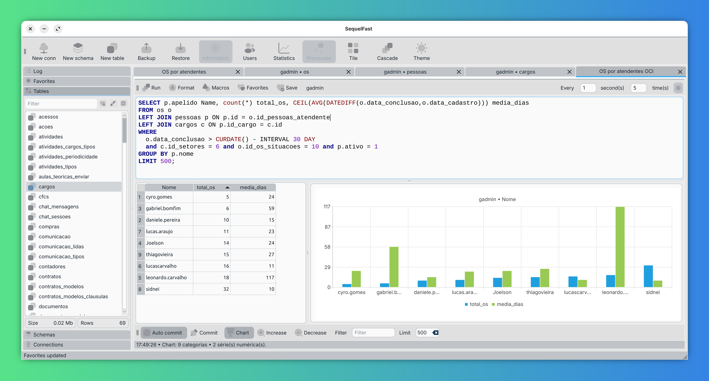
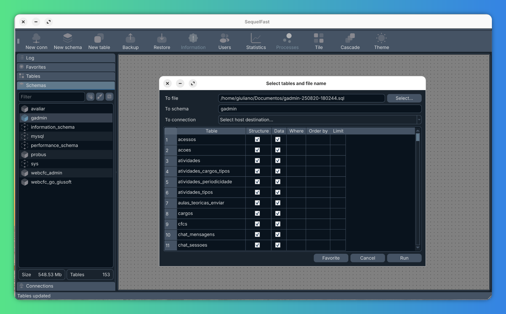

# SequelFast


**Open-source MySQL and MariaDB client focused on speed**






---

## 🚀 Current Features

<details>
<summary><strong>🖥️ Workspace</strong></summary>

- Light and dark themes
- Support for tabs, tiled, or cascaded child windows

</details>

<details>
<summary><strong>🔌 Connections</strong></summary>

- Add, edit, clone, and delete connections
- Connect via named pipe, TCP/IP, or SSH
- Assign custom colors (for connection list and SQL Editor)
- Filter connections easily

</details>

<details>
<summary><strong>👤 Users</strong></summary>

- Add, edit, and delete users
- Automatically runs `FLUSH PRIVILEGES`
- Easy permission inspection and management

</details>

<details>
<summary><strong>📊 Statistics</strong></summary>

- View charset, collation, encryption, size (MB), and table count
- Display environment variables

</details>

<details>
<summary><strong>📁 Schemas</strong></summary>

- Open, create, and drop schemas
- Backup and restore from file
- Transfer database to other connection
- View schema statistics
- Apply filters
- Save favorite filters

</details>

<details>
<summary><strong>📂 Tables</strong></summary>

- Open, create, edit (table format), and drop tables
- Apply filters
- Save favorite filters

</details>

<details>
<summary><strong>🛠️ Table Editor</strong></summary>

- Add, edit, and delete fields
- View change log

</details>

<details>
<summary><strong>📝 SQL Editor</strong></summary>

- Syntax highlighting
- Query formatting
- Save default queries per table
- Adjustable font size (with option to persist size)
- Timer feature to auto-execute queries at specific intervals
- Macros - To ask values in a Dialog

*Macros*

Example: 

```sql
SELECT * FROM table WHERE field = :ask_field
```

|Format|Means|Remarks|
|------|-----|-------|
|`~field`| Ask for a value and replace on query as string||
|`~field@type`|Ask for a formated value and replace on query|May be: string, number, date, datetime, bool and combo|
|`~field@type~default`|Ask for a formated value and replace on query|May be: string, number, date, datetime, bool and combo, using default value|
|`~field@combo~table`|Ask for a value on combobox and replace valueon query|Elements are aqcuired thru SELECT on table|
|`~field@combo~table~key`|Elements are aqcuired thru SELECT on table, using key|
|`~field@combo~table~key~field`|Elements are aqcuired thru SELECT on table, using key, and showing field|
|`~field@combo~table~key~field~order`|Elements are aqcuired thru SELECT on table, using key, showing field ordered by order|

</details>

<details>
<summary><strong>✏️ Data Editor</strong></summary>

- Inline editing for query results (when query has `Id` field and no `JOIN`s)
- Calendar widget for `DATE` and `DATETIME` fields
- Expanded text editor for large text fields
- Input masks for numeric fields
- Copy selected data (columns or rows) to clipboard in CSV, `INSERT`, or `UPDATE` format

</details>

<details>
<summary><strong>📊 Chart</strong></summary>

- Show dinamic charts
- Auto-refresh on sort, filter or query refresh

</details>

---

## 🧱 Technology Stack

- **Qt 6.9.1**
- **C++17**
- **Iconsax** (GNU GPL 3.0 License)

Icons by Lusaxweb:  
🔗 [Free Icons](https://www.freeicons.org/icons/iconsax)  
🔗 [Iconsax](https://iconsax.io/?ref=freeicons.org)

---

## 📦 Installation (Deployment)

### macOS (Intel)
1. Download `SequelFast.dmg` from the [Releases](https://github.com/seu-usuario/sequelfast/releases)
2. Open the `.dmg` and move `SequelFast.app` to `/Applications`

### Linux
Unzip the package and run the install script:
```bash
./install_linux.sh
```

### Running the App
```bash
SequelFast
```
Or double-click the `.app`/binary file depending on your platform.

---

## 👨‍💻 Development Setup

### Qt Installation
Download the Qt installer:
👉 [https://www.qt.io/download-open-source](https://www.qt.io/download-open-source)

Be sure to include the following during installation:

#### Qt Design Studio
- Qt Design Studio 4.7.2 (or newer)

#### Extensions
- Qt PDF
- Qt WebEngine

#### Qt Components
- Qt 6.9.1
  - Desktop components
  - Sources
  - Additional Libraries
  - Build Tools:
    - Qt Installer Framework 4.10
    - CMake 3.30.5
    - Ninja 1.12.1
    - OpenSSL Toolkit 3.0.16

#### Qt Creator
- Qt Creator 17.0.0

---

## ✅ Requirements

### MySQL / MariaDB Drivers
> It is recommended to use **MariaDB** drivers for better compatibility.

### Windows

*Setup environment variables to enable run qt commands on prompt (PowerShell)*

- Open Windows Explorer
- On Windows Search Bar, type: environment variable
- Open Environment Variables
- Edit "Path" variable
- Add: C:\Qt\6.9.1\mingw_64\bin

*Install MariaDB C Connector*

https://downloads.mariadb.com/Connectors/c/

Select default path: "C:\mariadb"

*Build QMYSQL driver*

```PowerShell
cd C:\mariadb\lib
gendef libmariadb.dll
dlltool -D libmariadb.dll -d libmariadb.def -l libmariadb.dll.a
cd \
mkdir build-sqldrivers
cd build-sqldrivers
qt-cmake -G Ninja C:\Qt\6.9.1\Src\qtbase\src\plugins\sqldrivers -DCMAKE_INSTALL_PREFIX=C:\Qt\6.9.1\mingw_64 -DFEATURE_sql_mysql=ON -DMySQL_INCLUDE_DIR=C:\mariadb\include\ -DMySQL_LIBRARY=C:\mariadb\lib\ -DMySQL_ROOT=C:\mariadb
cmake --build .
cmake --install .
```

### Ubuntu Linux
```bash
sudo apt -y install mariadb-server cmake build-essential libxcb-cursor0 libxcb-cursor-dev patchelf mariadb cmake ninja

mkdir build-sqldrivers
cd build-sqldrivers

~/Qt/6.9.1/gcc_64/bin/qt-cmake -G Ninja ~/Qt/6.9.1/Src/qtbase/src/plugins/sqldrivers -DCMAKE_INSTALL_PREFIX=~/Qt/6.9.1/gcc_64/
cmake --build . --parallel
cmake --install .
cp plugins/sqldrivers/libqsqlmysql.so ~/Qt/6.9.1/gcc_64/plugins/sqldrivers/
```

### Arch/Omarchy Linux

```bash
sudo pacman -S --needed \
  mariadb \
  base-devel \
  cmake \
  ninja \
  libxcb \
  xcb-util-cursor \
  patchelf

mkdir -p build-sqldrivers
cd build-sqldrivers
~/Qt/6.10.1/gcc_64/bin/qt-cmake \
  -G Ninja \
  ~/Qt/6.10.1/Src/qtbase/src/plugins/sqldrivers \
  -DCMAKE_INSTALL_PREFIX=~/Qt/6.10.1/gcc_64/

cmake --build . --parallel
cmake --install .
cp plugins/sqldrivers/libqsqlmysql.so \
   ~/Qt/6.10.1/gcc_64/plugins/sqldrivers/
```

# macOS

**Install Command Line Tools and MariaDB**
```bash
xcode-select --install
brew install mariadb cmake ninja
```

**Environment Setup**
Add this to your `~/.zshrc`:
```bash
export QTDIR=~/Qt/6.9.1/macos
export PATH="$PATH:$QTDIR/bin"
```

#### macOS Intel
```bash
mkdir build-sqldrivers
cd build-sqldrivers

~/Qt/6.9.1/macos/bin/qt-cmake -G Ninja ~/Qt/6.9.1/Src/qtbase/src/plugins/sqldrivers -DCMAKE_INSTALL_PREFIX=~/Qt/6.9.1/macos -DFEATURE_sql_mysql=ON -DMySQL_ROOT="$(brew --prefix mariadb)" -DMySQL_INCLUDE_DIR="$(brew --prefix mariadb)/include/mysql" -DMySQL_LIBRARY="$(brew --prefix mariadb)/lib/libmysqlclient.dylib" -DCMAKE_BUILD_TYPE=Debug

cmake --build . --parallel
cmake --install .
cp plugins/sqldrivers/libqsqlmysql.dylib ~/Qt/6.9.1/macos/plugins/sqldrivers/
```

#### macOS Silicon
```bash
mkdir build-sqldrivers
cd build-sqldrivers

~/Qt/6.9.1/macos/bin/qt-cmake -G Ninja ~/Qt/6.9.1/Src/qtbase/src/plugins/sqldrivers -DCMAKE_INSTALL_PREFIX=~/Qt/6.9.1/macos -DCMAKE_OSX_ARCHITECTURES=arm64 -DCMAKE_BUILD_TYPE=Debug -DCMAKE_CXX_STANDARD=17 -DCMAKE_CXX_EXTENSIONS=OFF -DFEATURE_sql_mysql=ON -DMySQL_ROOT="$(brew --prefix mariadb)" -DMySQL_INCLUDE_DIR="$(brew --prefix mariadb)/include/mysql" -DMySQL_LIBRARY="$(brew --prefix mariadb)/lib/libmysqlclient.dylib"
```
Before build, you *must replace* "-arch x86_64" mentions on build.ninja file to "-arch arm64"!

```bash
cmake --build . --parallel
cmake --install .
cp plugins/sqldrivers/libqsqlmysql.dylib ~/Qt/6.9.1/macos/plugins/sqldrivers/
```

---

## 🤝 Contributing

Contributions are welcome! If you’d like to fix a bug, add a feature, or improve the docs, feel free to open an issue or pull request.
