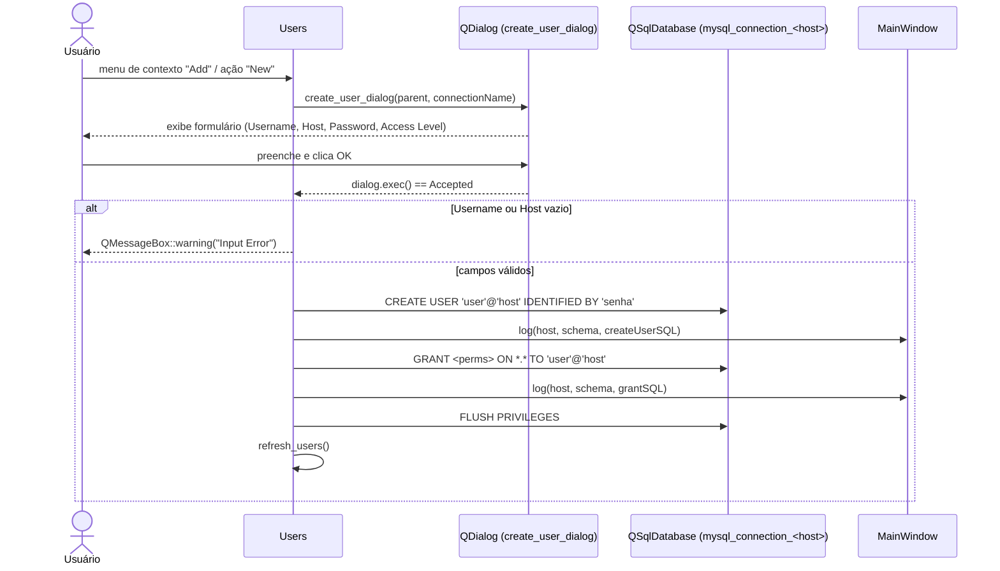
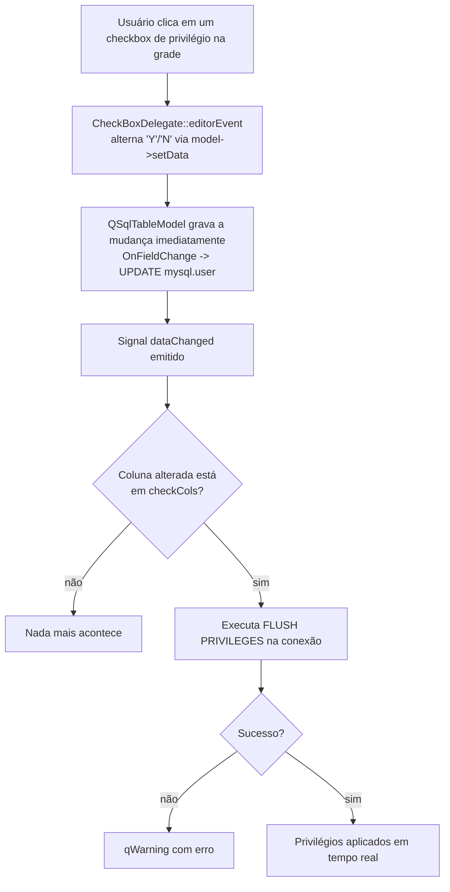

# Administração e Operações (Users, Statistics, Batch, Backup, Restore, SafetyLinterHandler)

## Visão Geral

Este subsistema agrupa as janelas e classes utilitárias do SequelFast responsáveis por operações
administrativas sobre uma conexão MySQL/MariaDB, fora do editor SQL principal (`Sql`):

- **`Users`** (`src/users.h/.cpp`) — janela MDI (`QMainWindow`) que lista, edita, cria e remove
  usuários MySQL a partir da tabela de sistema `mysql.user`, com atualização de privilégios via
  checkboxes e `FLUSH PRIVILEGES` automático.
- **`Statistics`** (`src/statistics.h/.cpp`) — diálogo (`QDialog`) somente leitura que mostra
  metadados do schema (charset, collation, criptografia, tamanho em MB, quantidade de tabelas) e
  a lista completa de variáveis de sistema (`performance_schema.global_variables`).
- **`Batch`** (`src/batch.h/.cpp`) — janela MDI (`QMainWindow`) com editor de texto (com
  destaque de sintaxe SQL) e uma `QTableView` de resultados. **Observação importante**: a
  implementação atual é um esqueleto de UI. O construtor apenas chama `ui->setupUi(this)` e
  instala o `SqlHighlighter`; nenhuma lógica de execução, carregamento de lista de conexões
  (`listViewConns`), lista de schemas (`listViewSchemas`) ou da ação `actionRun` definida no
  `.ui` está implementada em `batch.cpp`. Ou seja, hoje o "Batch" não executa nada — é apenas a
  casca visual da futura funcionalidade de execução em lote.
- **`Backup`** (`src/backup.h/.cpp`) — diálogo (`QDialog`) que gera um dump SQL de um schema para
  um arquivo `.sql` (opcionalmente também "restaurando" esse arquivo em outra conexão/host, na
  prática um dump seguido de restore). Permite escolher, por tabela, se estrutura e/ou dados
  devem ser exportados, com `WHERE`/`ORDER BY`/`LIMIT` por tabela, favoritos persistidos em
  preferências, barras de progresso e cancelamento.
- **`Restore`** (`src/restore.h/.cpp`) — classe utilitária (`QObject`) que lê um arquivo `.sql`
  linha a linha, remonta statements terminados em `;` e os executa sequencialmente na conexão
  alvo, com diálogo de progresso interruptível e log de erros em `restore.log`.
- **`SafetyLinterHandler`** (`src/SafetyLinterHandler.h`) — handler de uma cadeia de
  responsabilidade (`QueryHandler`) usado pelo editor SQL (`Sql::on_actionRun_triggered`, em
  `sql.cpp`) para interceptar comandos `DELETE`/`UPDATE` **sem cláusula `WHERE`** antes da
  execução e pedir confirmação explícita do usuário. É header-only (implementação inline na
  classe) e não é usado por `Batch` nem por `Backup`/`Restore` — apenas pelo editor SQL principal.

Todas essas classes reaproveitam a conexão MySQL global registrada como
`"mysql_connection_" + host` (via `QSqlDatabase::database(...)`) e o array global `connections`
(JSON com as conexões salvas), seguindo o mesmo padrão usado pelo restante do aplicativo.

## Diagrama de Classes

```mermaid
classDiagram
    class QueryHandler {
        -QueryHandler* next_
        +setNext(QueryHandler* n) void
        +handle(QString& sql, QWidget* parent) bool
    }

    class SafetyLinterHandler {
        +handle(QString& sql, QWidget* parent) bool
        -startsWithKeyword(QString s, char* kw) bool$
        -containsWord(QString s, char* word) bool$
        -maskStringsAndComments(QString in) QString$
        -splitStatements(QString sql) QStringList$
        -elide(QString s, int max) QString$
    }
    QueryHandler <|-- SafetyLinterHandler

    class Sql {
        +on_actionRun_triggered() void
    }
    Sql ..> SafetyLinterHandler : instancia e chama handle() antes de DELETE/UPDATE

    class Users {
        -Ui::Users* ui
        -QString usr_host
        -QString usr_schema
        +refresh_users() void
        +create_user_dialog(QWidget* parent, QString connectionName) void
        +delete_selected_user() void
        -show_context_menu(QPoint pos) void
        -on_actionRefresh_triggered() void
        -on_actionNew_triggered() void
        -on_actionDelete_triggered() void
    }
    Users --|> QMainWindow
    Users ..> CheckBoxDelegate : usa nas colunas *_priv
    Users ..> MainWindow : mainWin->log(...)

    class CheckBoxDelegate {
        +paint(...) void
        +editorEvent(...) bool
    }
    CheckBoxDelegate --|> QStyledItemDelegate

    class Statistics {
        -Ui::Statistics* ui
        +Statistics(QString host, QString schema, QWidget parent)
        -on_tableView_cellClicked(QModelIndex index) void
    }
    Statistics --|> QDialog

    class Batch {
        -Ui::Batch* ui
        -QString usr_host
        -QString usr_scheme
        +Batch(QString host, QString schema, QWidget parent)
    }
    Batch --|> QMainWindow
    Batch ..> SqlHighlighter : cria para ui->textQuery

    class Backup {
        -QLineEdit* lineEdit
        -QTableView* tableView
        -QComboBox* connList
        -QLineEdit* schemaEdit
        -TwoCheckboxDelegate* checkboxDelegate
        -QStandardItemModel* model
        -bool abort
        -bool running
        +Backup(QString host, QString schema, QWidget parent)
        +refresh_conns() void
        +refresh_tables() void
        -chooseFile() void
        -onFavorite() void
        -onConfirm() void
        -onCancel() void
        -onHeaderClicked(int section) void
        -onSchemaEditTextChanged(QString newText) void
    }
    Backup --|> QDialog
    Backup ..> TwoCheckboxDelegate : usa nas colunas Structure/Data
    Backup ..> Restore : cria e chama run() para "transfer to other connection"
    Backup ..> "functions.h" : getStringPreference/setStringPreference (favoritos por tabela)
    Backup ..> "functions.h" : connectMySQL (abre conexão de destino)

    class Restore {
        -bool showMessage
        +Restore(QObject parent)
        +run(QString fileName, QString bkp_prefix, QString bkp_host, QString bkp_schema, QWidget parent) void
    }
    Restore --|> QObject
    Restore ..> InterruptibleProgressDialog : usa (classe local no .cpp)

    class InterruptibleProgressDialog {
        -bool& aborted
        +keyPressEvent(QKeyEvent event) void
        +closeEvent(QCloseEvent event) void
    }
    InterruptibleProgressDialog --|> QDialog

    class TwoCheckboxDelegate {
        +paint(...) void
        +editorEvent(...) bool
    }
    TwoCheckboxDelegate --|> QStyledItemDelegate

    class MainWindow {
        +on_actionUsers_triggered() void
        +batch_run() void
        +backup(QString host, QString schema, QWidget parent) void
        +restore(QString host, QString schema, QWidget parent) void
        +on_actionStatistics_triggered() void
    }
    MainWindow ..> Users : cria em QMdiSubWindow
    MainWindow ..> Batch : cria em QMdiSubWindow
    MainWindow ..> Statistics : cria e chama exec()
    MainWindow ..> Backup : cria e chama exec()
    MainWindow ..> Restore : cria e chama run() diretamente (ação "Restore")
```

## Referência de API

### `Users`

| Método | Descrição |
|---|---|
| `Users(QString& host, QString& schema, QWidget* parent)` | Constrói a janela, define título `host • schema` e chama `refresh_users()`. |
| `void refresh_users()` | (Re)carrega um `QSqlTableModel` sobre `mysql.user` com `setEditStrategy(OnFieldChange)` (grava a cada edição de célula), oculta todas as colunas exceto a lista fixa de usuário/host/privilégios, instala `CheckBoxDelegate` nas colunas de privilégio/flags booleanas e conecta `dataChanged` para disparar `FLUSH PRIVILEGES` sempre que uma coluna de privilégio é alterada. |
| `void create_user_dialog(QWidget* parent, const QString& connectionName)` | Abre um `QDialog` modal para criar usuário (nome, host, senha, nível de acesso: Read only / Software / Admin). Executa `CREATE USER ... IDENTIFIED BY ...`, depois `GRANT ... ON *.* TO ...` conforme o nível escolhido, e por fim `FLUSH PRIVILEGES`. Cada statement executado é registrado via `MainWindow::log(...)`. |
| `void delete_selected_user()` | Confirma via `QMessageBox`, resolve `User`/`Host` da linha selecionada (mapeando proxy → modelo fonte), executa `DROP USER 'user'@'host'` seguido de `FLUSH PRIVILEGES`, e atualiza a grade. |

**Slots privados**: `show_context_menu(pos)` (menu de contexto Add/Delete na tabela),
`on_actionRefresh_triggered`, `on_actionNew_triggered`, `on_actionDelete_triggered` — todos
delegam para os métodos públicos acima e são conectados automaticamente pela convenção
`on_<objectName>_<signal>` do Qt Designer às `QAction`s da toolbar/menu definidas em `users.ui`.

Classe auxiliar `CheckBoxDelegate` (definida no topo de `users.cpp`, não exportada em header):
renderiza um checkbox para colunas cujo valor é `"Y"`/`"N"` e alterna o valor com um clique
(sem abrir editor de texto).

### `Statistics`

| Método | Descrição |
|---|---|
| `Statistics(QString& host, QString& schema, QWidget* parent = nullptr)` | Monta a UI, preenche `lineName` com o schema, carrega um `QSqlQueryModel` com `SELECT * FROM performance_schema.global_variables` (com filtro de texto via `QSortFilterProxyModel` ligado a `lineFilter`), e consulta `information_schema.SCHEMATA` para preencher charset/collation/encryption, além de duas consultas agregadas em `information_schema.TABLES`/`.tables` para tamanho (MB, `data_length + index_length`) e contagem de tabelas do schema. |
| `~Statistics()` | Libera `ui`. |

**Slot privado**: `on_tableView_cellClicked(index)` — ao clicar em uma célula da grade de
variáveis, mostra um `QMessageBox` com o nome (coluna 0) e valor completo (coluna 1) da variável,
incluindo texto detalhável (`setDetailedText`) para valores longos.

Não há signals customizados; a classe é um `QDialog` de exibição, sem edição.

### `Batch`

| Método | Descrição |
|---|---|
| `Batch(QString& host, QString& schema, QWidget* parent)` | Monta a UI (`batch.ui`, contendo `listViewConns`, `listViewSchemas`, `textQuery`, `tableData`, `actionRun`) e instala um `SqlHighlighter` no editor `textQuery`. **Não há mais nenhuma lógica**: os parâmetros `host`/`schema` recebidos não são sequer atribuídos aos membros `usr_host`/`usr_scheme` (permanecem com valor padrão `QString()`), nenhuma lista de conexões/schemas é carregada e a ação `actionRun` não está conectada a nenhum slot. |
| `~Batch()` | Libera `ui`. |

Não há slots, signals ou métodos públicos além do construtor/destrutor — é a superfície mínima
de uma tela ainda não implementada.

### `Backup`

| Método | Descrição |
|---|---|
| `Backup(const QString& host, const QString& schema, QWidget* parent = nullptr)` | Monta a UI em código (não usa `.ui`): campo de arquivo destino (pré-preenchido com `Documents/<schema>-<timestamp>.sql`), campo de schema destino, combo de conexão destino ("To connection"), grade de tabelas com colunas Structure/Data/Where/Order by/Limit, botões Favorite/Cancel/Run e duas `QProgressBar` (tabelas e linhas). Chama `refresh_tables()` e `refresh_conns()`. |
| `void refresh_conns()` | Popula o combo `connList` com `"Select host destination..."` mais o nome de cada conexão salva em `connections` (array JSON global). |
| `void refresh_tables()` | Executa `USE <schema>` e `SHOW TABLES` na conexão de origem, monta um `QStandardItemModel` com uma linha por tabela, aplicando `TwoCheckboxDelegate` nas colunas Structure/Data e recuperando valores previamente salvos como "favoritos" (`getStringPreference("bkp-table:<tabela>:...")`). |
| `chooseFile()` *(slot)* | Abre `QFileDialog::getSaveFileName`, com verificação de sobrescrita e de existência do diretório, revalidando em loop até um caminho válido ou cancelamento. |
| `onFavorite()` *(slot)* | Persiste, por tabela, as flags Structure/Data e os textos Where/OrderBy/Limit em preferências (`setStringPreference`), para reuso em backups futuros do mesmo schema. |
| `onConfirm()` *(slot)* | Executa o backup (ver fluxo detalhado abaixo). |
| `onCancel()` *(slot)* | Marca `abort = true`; só fecha o diálogo (`reject()`) imediatamente se não houver um backup em andamento (`running == false`) — caso contrário o loop de exportação detecta a flag e interrompe de forma cooperativa. |
| `onHeaderClicked(int section)` *(slot)* | Clique no cabeçalho das colunas Structure/Data (1/2) inverte o valor booleano em todas as linhas (toggle geral); clique nas colunas Where/OrderBy/Limit (3/4/5) limpa o texto em todas as linhas. |
| `onSchemaEditTextChanged(const QString&)` *(slot)* | Ao digitar um novo nome de schema destino, se já houver um caminho de arquivo definido, recalcula o nome do arquivo sugerido (`<novoSchema>-<timestamp>.sql`) na mesma pasta de Documents. |
| `keyPressEvent` / `closeEvent` *(protected, overrides)* | `Esc` e fechar a janela (X) chamam `onCancel()` em vez de fechar diretamente — `closeEvent` sempre ignora o evento (`event->ignore()`), delegando a decisão de fechar para `onCancel()`/`onConfirm()`. |

Não há signals customizados declarados (`Q_OBJECT` presente apenas para slots/QObject).

### `Restore`

| Método | Descrição |
|---|---|
| `Restore(QObject* parent = nullptr)` | Construtor trivial. |
| `void run(QString fileName, const QString& bkp_prefix, const QString& bkp_host, const QString& bkp_schema, QWidget* parent)` | Executa a restauração de um arquivo `.sql` (ver fluxo abaixo). Se `fileName` vier vazio, abre um `QFileDialog` para o usuário escolher o arquivo (e nesse caso marca `showMessage = true`, exibindo diálogos finais de sucesso/cancelamento; quando chamado com um `fileName` já definido — como faz `Backup::onConfirm()` — esses diálogos finais não aparecem). |

Sem signals; usa uma classe auxiliar local ao `.cpp`, `InterruptibleProgressDialog`, que ouve
`Esc` e o fechamento da janela para setar uma flag `aborted` por referência.

### `SafetyLinterHandler` / `QueryHandler`

| Método | Descrição |
|---|---|
| `QueryHandler::setNext(QueryHandler* n)` | Encadeia o próximo handler da cadeia de responsabilidade (Chain of Responsibility). Hoje, na prática, `SafetyLinterHandler` é usado isoladamente em `sql.cpp` (sem próximo handler configurado). |
| `virtual bool QueryHandler::handle(QString& sql, QWidget* parent)` | Implementação base: repassa para o próximo handler (ou retorna `true` se não houver). |
| `bool SafetyLinterHandler::handle(QString& sql, QWidget* parent) override` | Ver fluxo detalhado abaixo. Retorna `false` para abortar o pipeline de execução se o usuário não confirmar um `DELETE`/`UPDATE` sem `WHERE`; caso contrário retorna o resultado de `QueryHandler::handle(...)` (ou seja, `true` quando não há próximo handler). |
| `static bool startsWithKeyword(...)`, `containsWord(...)`, `maskStringsAndComments(...)`, `splitStatements(...)`, `elide(...)` | Helpers privados estáticos de análise textual (ver Observações de Implementação). |

Não há signals; é uma classe de uso síncrono, chamada diretamente dentro de
`Sql::on_actionRun_triggered` (`src/sql.cpp`, próximo à linha 1447).

## Fluxos Principais

### 1. Criar/editar um usuário MySQL (até o `FLUSH PRIVILEGES`)



Edição de privilégios existentes (grade principal):



Exclusão de usuário segue o mesmo padrão: confirmação via `QMessageBox`, `DROP USER`, depois
`FLUSH PRIVILEGES`, depois `refresh_users()`.

### 2. Fazer backup de um schema para arquivo (com cancelamento)

```mermaid
flowchart TD
    Start([onConfirm chamado]) --> Init[running = true<br/>resolve exportToFile / exportToHost]
    Init --> OpenFile{lineEdit tem caminho?}
    OpenFile -- sim --> WOpen[Abre QFile p/ escrita<br/>exportToFile = true]
    OpenFile -- não --> Skip1[exportToFile = false]
    WOpen --> Header
    Skip1 --> Header
    Header[Escreve cabeçalho:<br/>CREATE DATABASE IF NOT EXISTS / USE<br/>SET FOREIGN_KEY_CHECKS=0 / UNIQUE_CHECKS=0<br/>SET autocommit=0 / START TRANSACTION]
    Header --> Loop{Para cada tabela<br/>selecionada na grade}
    Loop -- abort==true --> SkipRow[Pula processamento desta tabela]
    Loop -- abort==false --> CheckFlags{Structure e/ou<br/>Data marcados?}
    CheckFlags -- não --> NextTable
    CheckFlags -- sim --> Struct{Structure?}
    Struct -- sim --> ShowCreate[SHOW CREATE TABLE<br/>grava DROP TABLE IF EXISTS + CREATE TABLE]
    Struct -- não --> DataCheck
    ShowCreate --> DataCheck{Data?}
    DataCheck -- sim --> CountRows[SELECT COUNT(*) com WHERE/ORDER BY/LIMIT<br/>configura progressBar2]
    CountRows --> SelectRows[SELECT * ... com mesmos filtros]
    SelectRows --> RowLoop{Para cada linha<br/>(interrompível por abort)}
    RowLoop -- abort==true --> StopRows[Interrompe leitura de linhas]
    RowLoop -- abort==false --> Escape[Escapa aspas simples, CR/LF,<br/>formata datas/hora/binário (hex)]
    Escape --> WriteInsert[Escreve INSERT INTO ...]
    WriteInsert --> RowLoop
    StopRows --> NextTable
    DataCheck -- não --> NextTable
    NextTable[Atualiza progressBar / processEvents] --> Loop
    SkipRow --> Loop
    Loop -- fim das tabelas --> Footer[Escreve COMMIT / autocommit=1 / FOREIGN_KEY_CHECKS=1 / UNIQUE_CHECKS=1<br/>fecha arquivo]
    Footer --> Transfer{exportToHost E<br/>arquivo definido?}
    Transfer -- sim --> ConnectDest[connectMySQL(hostDestino, prefix='backup_')<br/>abre dbMysql]
    ConnectDest --> RunRestore[Restore::run(arquivo, 'backup_', hostDestino, schemaDestino, parent)<br/>reexecuta o próprio arquivo gerado no destino]
    Transfer -- não --> Finish
    RunRestore --> Finish
    Finish{abort == true?}
    Finish -- sim --> MsgCancel[QMessageBox 'Backup cancelled!'<br/>dialog.reject()]
    Finish -- não --> MsgOk[QMessageBox 'Backup created successfully!'<br/>dialog.accept()]
```

Observação sobre cancelamento: `onCancel()` (botão Cancel, tecla Esc, ou fechar a janela) apenas
seta `abort = true`. Como toda a exportação roda de forma síncrona na *thread* de UI (com
`QApplication::processEvents()` chamado a cada linha/tabela para manter a interface responsiva),
o loop em `onConfirm()` verifica `abort` a cada iteração e interrompe a escrita assim que possível
— não há cancelamento via thread separada ou `QFuture`/`QThread`.

### 3. Restaurar um backup de arquivo

```mermaid
sequenceDiagram
    actor U as Usuário
    participant MW as MainWindow / Backup
    participant R as Restore
    participant FD as QFileDialog
    participant PD as InterruptibleProgressDialog
    participant DB as QSqlDatabase (bkp_prefix + bkp_host)

    MW->>R: run(fileName, prefix, host, schema, parent)
    alt fileName vazio (ação "Restore" do menu)
        R->>FD: getOpenFileName(...)
        FD-->>R: caminho escolhido (ou vazio = cancelado)
        R->>R: showMessage = true
    else fileName já definido (chamado por Backup::onConfirm)
        Note over R: usa o arquivo recém-gerado do backup, sem diálogo
    end
    R->>R: abre arquivo .sql para leitura
    R->>PD: cria e exibe diálogo de progresso modal
    R->>R: lê o arquivo linha a linha,<br/>ignora vazias e comentários "--",<br/>acumula até encontrar ';' no fim da linha
    loop para cada statement remontado
        alt aborted (Esc ou fechar diálogo)
            R->>R: interrompe o loop
        else
            R->>DB: query.exec(statement)
            alt erro
                R->>R: grava erro em restore.log (qWarning + arquivo)
            end
            R->>PD: atualiza progressBar + processEvents
        end
    end
    R->>PD: progressDialog.accept()
    alt showMessage == true
        alt aborted
            R-->>U: QMessageBox "Cancelled"
        else
            R-->>U: QMessageBox "Done"
        end
    end
```

### 4. Como o `SafetyLinterHandler` intercepta uma query perigosa

O `SafetyLinterHandler` **não impede** a execução de qualquer query por padrão — ele é
especificamente restrito a interceptar `DELETE` e `UPDATE` sem cláusula `WHERE` no nível do
statement, pedindo confirmação explícita antes de deixar o comando seguir. Não trata `DROP`,
`TRUNCATE`, `ALTER`, `DELETE`/`UPDATE` com `WHERE` sempre-verdadeiro (`WHERE 1=1`), nem qualquer
outra query "perigosa" — apenas a ausência textual da palavra `WHERE` fora de strings/comentários.

```mermaid
flowchart TD
    A[Sql::on_actionRun_triggered<br/>comando não é SELECT/SHOW/DESCRIBE/EXPLAIN] --> B[Cria SafetyLinterHandler linter<br/>chama linter.handle(sql, this)]
    B --> C[splitStatements: separa por ';'<br/>ignora vazios]
    C --> D{Para cada statement}
    D --> E{Começa com<br/>DELETE ou UPDATE?}
    E -- não --> D
    E -- sim --> F[maskStringsAndComments:<br/>remove /* */ , -- e # até fim da linha,<br/>strings '...' e "..." -> substitui por espaços]
    F --> G{Texto mascarado<br/>contém palavra WHERE?}
    G -- sim --> D
    G -- não --> H[Monta mensagem com operação e trecho (max 220 chars)]
    H --> I[QMessageBox::question<br/>'Security confirmation' Yes/No, default No]
    I -- No --> J[handle() retorna false<br/>Sql exibe 'Execução cancelada pelo usuário.' e RETORNA sem executar nada]
    I -- Yes --> D
    D -- todos statements OK/confirmados --> K[QueryHandler::handle base:<br/>chama next_->handle se houver, senão retorna true]
    K --> L[Sql prossegue: QSqlQuery query2.exec(queryStr)<br/>executa a string ORIGINAL completa, não statement a statement]
```

Pontos relevantes desse fluxo:
- A validação é feita statement a statement (dividido por `;`), mas a **execução real** em
  `sql.cpp` roda `query2.exec(queryStr)` com a string inteira — ou seja, o linter analisa por
  partes, mas quem executa depende do driver Qt aceitar múltiplos comandos separados por `;` em
  uma única chamada (não há execução statement-a-statement dentro do próprio `Sql`).
- Basta **um** statement sem confirmação (`No`) para abortar todo o lote — o `handle()` retorna
  `false` assim que o primeiro `No` acontece, sem processar os statements restantes.
- É acoplado apenas ao editor SQL principal (`Sql`); `Batch` (execução em lote) e
  `Backup`/`Restore` **não** passam pelo `SafetyLinterHandler`.

## Observações de Implementação

- **Escaping em `Backup`**: valores string são escapados manualmente (`'` → `''`, `\r`, `\n`),
  datas/horas convertidas para `'yyyy-MM-dd HH:mm:ss'`/`'HH:mm:ss'`, e campos binários
  (`QVariant::ByteArray`) exportados como literais hexadecimais MySQL (`X'...'`). Não há
  tratamento explícito para tipos JSON/`ENUM`/`SET` além de tratá-los como string genérica no
  `else` final (`'valor'`) — pode ser um ponto de atenção para tipos com aspas/caracteres
  especiais não cobertos pelos casos acima.
- **Transferência entre hosts não é uma cópia direta**: "backup to other host/schema" (mencionado
  no histórico de commits) é implementado como *dump para arquivo local seguido de restore desse
  mesmo arquivo* na conexão de destino (`connectMySQL` + `Restore::run`). Não existe um caminho de
  streaming direto banco-a-banco; o arquivo intermediário sempre é gravado em disco antes.
- **Cancelamento é cooperativo e síncrono**: tanto `Backup` (`abort`) quanto `Restore`
  (`aborted`, via `InterruptibleProgressDialog`) rodam a operação inteira na thread de UI,
  chamando `QApplication::processEvents()` a cada linha/tabela para permanecer responsivos e
  permitir que o usuário dispare o cancelamento (Esc, botão Cancel, fechar janela). Não há
  `QThread`/worker separado — para backups muito grandes isso significa que a UI trava
  parcialmente entre chamadas de `processEvents()` e que o cancelamento só é percebido no próximo
  ponto de checagem do loop, não instantaneamente.
- **Performance em backups grandes**: cada linha da tabela gera um `INSERT INTO ... VALUES (...)`
  individual (não há agrupamento em lotes/multi-row `INSERT`), e cada linha dispara
  `QApplication::processEvents()` — favorece responsividade da UI em detrimento de velocidade bruta
  de exportação/gravação em arquivo para tabelas muito grandes.
- **Parsing de `Restore` é ingênuo por design**: os statements são remontados concatenando linhas
  até encontrar uma que termine em `;`, e apenas linhas iniciadas por `--` são tratadas como
  comentário (comentários `#` ou `/* */` de várias linhas não são explicitamente ignorados, apenas
  teriam que coincidentemente não conter `;` de fim de linha para não quebrar o parsing). Isso é
  suficiente para os arquivos gerados pelo próprio `Backup` (que controla o formato de saída), mas
  é frágil para arquivos `.sql` externos com formatação diferente (ex.: múltiplos statements na
  mesma linha, ou comentários de bloco contendo `;`).
- **Favoritos de backup por tabela** (`Backup::onFavorite`) são persistidos em preferências com
  chave `bkp-table:<nome_tabela>:<campo>` (structure, tableData, where, orderBy, limit) e
  recarregados em `refresh_tables()` — são globais por nome de tabela (não segmentados por
  schema/host), então tabelas de mesmo nome em schemas diferentes compartilham a mesma
  configuração salva.
- **`Users`** grava alterações de privilégio imediatamente por célula
  (`QSqlTableModel::OnFieldChange`) e só dispara `FLUSH PRIVILEGES` quando a coluna alterada
  pertence à lista fixa `checkCols` — uma edição em outra coluna (se exposta) não recarregaria os
  privilégios em cache do servidor.
- **`Batch` está incompleto**: apesar do `.ui` (`src/batch.ui`) já definir `listViewConns`,
  `listViewSchemas`, `textQuery`, `tableData` e a ação `actionRun`, o `.cpp` correspondente não
  implementa nenhum slot ou carregamento de dados — a tela abre, mas não executa lotes de SQL.
  Isso deve ser tratado como funcionalidade planejada, não implementada.
- **`SafetyLinterHandler` é intencionalmente escopado a DELETE/UPDATE sem WHERE**: não é um
  linter de segurança geral (não cobre `DROP`, `TRUNCATE TABLE`, `ALTER TABLE ... DROP COLUMN`,
  injeção de SQL, etc.), e sua detecção de `WHERE` é textual/regex (com mascaramento de strings e
  comentários), não um parser SQL real — pode ter falsos negativos/positivos em SQL muito
  incomum (ex.: `WHERE` dentro de identificadores entre crases não é mascarado, embora seja
  improvável colidir com a palavra completa `WHERE`).
