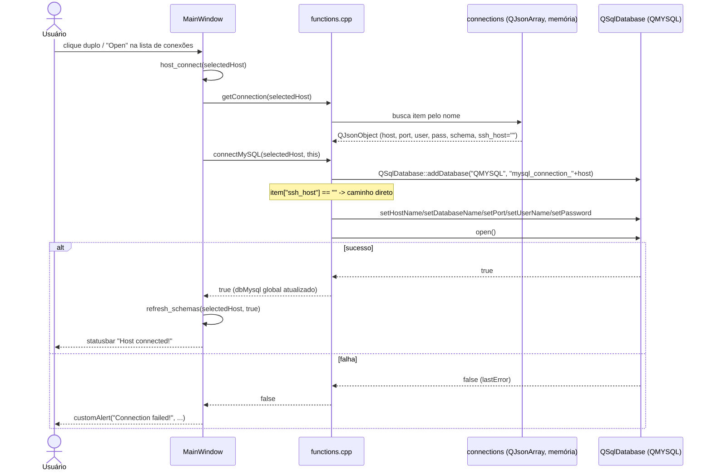
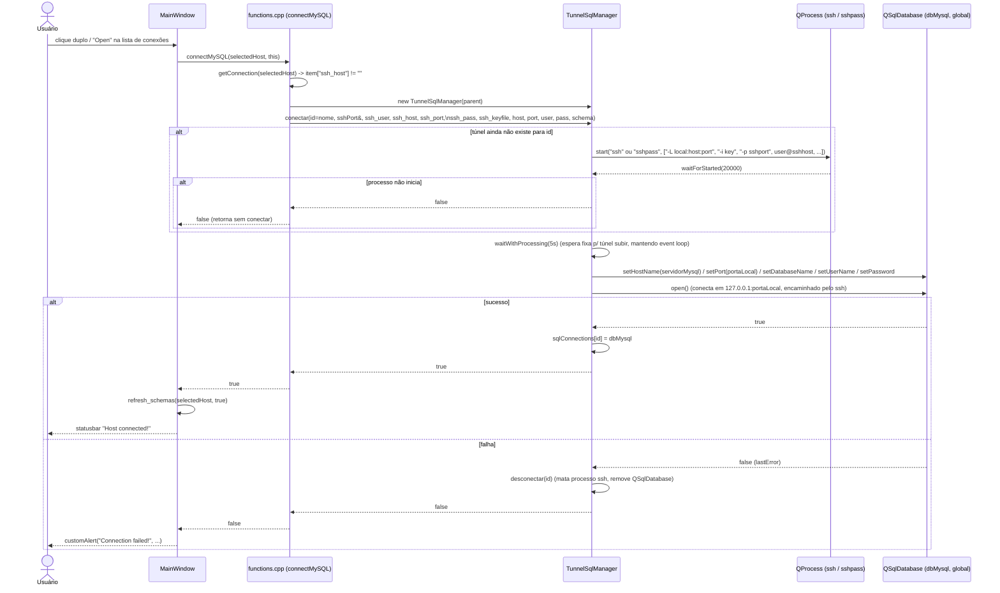

# Conexões e Túnel SSH (Connection, TunnelSqlManager)

## Visão Geral

O subsistema de conexões do SequelFast é responsável por:

1. **Cadastrar, editar, clonar e remover** definições de conexão (host, porta, usuário, senha, schema padrão, cor, parâmetros de SSH) através da classe `Connection` (`src/connection.h/.cpp`, UI em `src/connection.ui`).
2. **Persistir** essas definições em um banco SQLite local de preferências (tabela `conns`), através de funções livres em `src/functions.h/.cpp` (`openPreferences`, `getConnection`, `addConnection`, `deleteConnection`).
3. **Efetivamente abrir** a conexão MySQL/MariaDB usada pelo restante da aplicação, seja diretamente via `QSqlDatabase` (TCP/IP) seja através de um túnel SSH local criado com o processo externo `ssh`/`sshpass`, encapsulado pela classe `TunnelSqlManager` (`src/tunnelsqlmanager.h/.cpp`).

Vale notar que existem **dois caminhos de código para abrir uma conexão MySQL**, que não estão totalmente unificados:

- `Connection::on_buttonConnect_clicked()` (dentro do próprio diálogo de conexão) — abre a conexão diretamente via `QSqlDatabase` (sem suporte a SSH), aparentemente usado apenas para testar a conexão a partir do diálogo.
- `connectMySQL()` (função livre em `src/functions.cpp`) — é o caminho realmente usado pelo restante do aplicativo (`MainWindow::host_connect`, `sql.cpp`, `backup.cpp`, `macroinputdialog.cpp`) e é o único que decide entre conexão direta e conexão via túnel SSH, delegando a `TunnelSqlManager` quando o campo `ssh_host` da conexão não está vazio.

Named pipe (citado no README) não foi encontrado implementado em nenhum destes dois arquivos — ver seção "Observações de Implementação".

## Diagrama de Classes

```mermaid
classDiagram
    class Connection {
        -Ui::Connection* ui
        +Connection(QString selectedHost, QWidget* parent)
        +saveConnection() void
        -on_buttonCancel_clicked() void
        -on_buttonSave_clicked() void
        -on_buttonRemove_clicked() void
        -on_buttonConnect_clicked() void
        -on_dial_valueChanged(int value) void
    }

    class TunnelSqlManager {
        -QMap~QString,QProcess*~ sshTunnels
        -QMap~QString,QSqlDatabase~ sqlConnections
        +TunnelSqlManager(QObject* parent)
        +conectar(id, porta&, usuarioSsh, servidorSsh, portaSsh, senhaSsh, keyfileSsh, servidorMysql, portaMysql, usuarioMysql, senhaMysql, banco) bool
        +desconectar(id) void
        +obterConexao(id) QSqlDatabase
    }

    class QProcess {
        <<Qt>>
    }

    class QSqlDatabase {
        <<Qt>>
    }

    class FunctionsCpp {
        <<free functions - functions.cpp>>
        +openPreferences() bool
        +getConnection(name) QJsonObject
        +addConnection(...) bool
        +deleteConnection(name) bool
        +connectMySQL(selectedHost, parent, prefix) bool
    }

    class MainWindow {
        +host_connect(selectedHost) bool
        +listViewConns_clone(index) void
        +keepConnection() void
    }

    Connection ..> FunctionsCpp : getConnection() / deleteConnection()
    Connection --> QSqlDatabase : abre "mysql_connection_<name>" (teste direto, sem SSH)
    FunctionsCpp --> QSqlDatabase : addDatabase("QMYSQL", prefix+host)
    FunctionsCpp --> TunnelSqlManager : cria e chama conectar() quando ssh_host != ""
    TunnelSqlManager --> QProcess : spawna "ssh" ou "sshpass ssh -L local:remoteHost:remotePort"
    TunnelSqlManager --> QSqlDatabase : configura dbMysql global apontando p/ 127.0.0.1:portaLocal
    MainWindow --> Connection : abre o diálogo (Edit/Clone/New)
    MainWindow --> FunctionsCpp : connectMySQL() a partir de host_connect()
    MainWindow --> QSqlDatabase : keepConnection() executa "SELECT 1" periodicamente
```

## Referência de API

### class `Connection`

`Connection` é um `QDialog` (definido em `src/connection.h`, implementado em `src/connection.cpp`, layout em `src/connection.ui`) que representa o formulário de criação/edição de uma conexão. A UI expõe campos como `lineName`, `lineHost`, `linePort`, `lineUser`, `linePass`, `lineSchema`, os campos SSH `lineSSHhost`, `lineSSHport`, `lineSSHuser`, `lineSSHpass`, `lineSSHkey`, o `QCheckBox sharedFavorites` e um `QDial dial` usado como seletor visual de cor, além dos botões `buttonSave`, `buttonConnect`, `buttonRemove`, `buttonCancel`.

#### Métodos públicos

| Assinatura | Descrição |
|---|---|
| `explicit Connection(QString selectedHost, QWidget* parent = nullptr)` | Constrói o diálogo, carrega os dados salvos da conexão `selectedHost` (via `getConnection`) e preenche os campos da UI, inclusive posicionando o `dial` na cor associada. |
| `~Connection()` | Destrutor; libera `ui`. |
| `void saveConnection()` | Persiste (via `UPDATE`) todos os campos do formulário na tabela `conns` do SQLite de preferências, usando `thatHost` (nome original, capturado no construtor) como chave de busca — ou seja, faz `UPDATE ... WHERE name = :name_to_update`, permitindo inclusive renomear a conexão (`name` é atualizado para o novo valor de `lineName`). Ao final chama `openPreferences()` para recarregar o array global `connections` em memória. |

#### Slots privados (ligados por convenção de nomes do Qt Designer aos botões/widgets da UI)

| Slot | Gatilho | Comportamento |
|---|---|---|
| `on_buttonCancel_clicked()` | Botão "Cancel" | `reject()` — fecha o diálogo sem salvar. |
| `on_buttonSave_clicked()` | Botão "Save" | Chama `saveConnection()` e depois `accept()`. |
| `on_buttonRemove_clicked()` | Botão "Remove" | Chama `deleteConnection(thatHost)` (função livre de `functions.cpp`) e `accept()`. |
| `on_buttonConnect_clicked()` | Botão "Connect" | Salva a conexão (`saveConnection()`), depois cria diretamente uma `QSqlDatabase` MySQL (`"mysql_connection_" + lineName`), define timeouts/opções e chama `dbMysql.open()`, mostrando um `QMessageBox` em caso de falha. **Não usa `TunnelSqlManager`** — não há suporte a SSH neste caminho específico, mesmo que a conexão tenha campos SSH preenchidos. |
| `on_dial_valueChanged(int value)` | Rotação do `QDial` de cor | Busca em `colors` (QJsonArray global, populada em `functions.cpp` a partir de `colorThemes`, com paletas distintas para tema claro e escuro) o objeto `{name, rgb}` correspondente ao índice `value`, aplica o `rgb` como `background-color` via stylesheet inline no próprio `QDial` e guarda o nome em `thatColor` (variável global do arquivo, usada depois por `saveConnection()`). |

Não há sinais (`signals`) customizados declarados na classe — a comunicação com `MainWindow` é feita apenas pelo valor de retorno de `QDialog::exec()` (`QDialog::Accepted`/`Rejected`), verificado por quem instancia o diálogo (`MainWindow::listViewConns_edit`, `listViewConns_clone`, criação de nova conexão) para decidir se chama `refresh_connections()`.

#### Persistência dos dados de conexão

- **Não** usa `QSettings`. Os dados são gravados em um banco **SQLite** próprio (`preferences.db`), aberto/gerenciado em `functions.cpp` através da conexão nomeada `"pref_connection"` (`QSqlDatabase dbPreferences`).
- O arquivo fica em `QStandardPaths::writableLocation(QStandardPaths::AppDataLocation)` (tipicamente `~/.local/share/SequelFastTeam/SequelFast/preferences.db` no Linux).
- A tabela relevante é `conns`, criada em `openPreferences()`:
  ```sql
  CREATE TABLE IF NOT EXISTS conns (
      id INTEGER PRIMARY KEY AUTOINCREMENT,
      shared INT DEFAULT 0,
      name TEXT NULL,
      color TEXT NULL,
      host TEXT NULL,
      port TEXT NULL,
      schema TEXT NULL,
      user TEXT NULL,
      pass TEXT NULL,
      ssh_host TEXT NULL,
      ssh_port TEXT NULL,
      ssh_user TEXT NULL,
      ssh_pass TEXT NULL,
      ssh_keyfile TEXT NULL
  )
  ```
- **A senha (`pass`) e a senha SSH (`ssh_pass`) são gravadas em texto puro** nessa tabela SQLite, sem qualquer criptografia ou uso do cofre de credenciais do SO (nada como `QKeychain`/Secret Service foi encontrado no código lido). Ver observações de segurança abaixo.
- Todo o conjunto de conexões é mantido também em memória, em um `QJsonArray connections` global (`extern` em vários `.cpp`), recarregado a cada `openPreferences()` (chamado após qualquer save/insert/delete) a partir de `SELECT * FROM conns ORDER BY name`. `getConnection(name)` apenas varre esse array em memória — não consulta o SQLite diretamente.
- Funções de escrita relacionadas (em `functions.cpp`, usadas por `MainWindow` e por `Connection`):
  - `bool addConnection(name, color, host, user, pass, port, ssh_host, ssh_user, ssh_pass, ssh_port, ssh_keyfile)` — `INSERT` apenas se não existir já uma linha com o mesmo `name` (`SELECT ... WHERE name = :name` antes do insert).
  - `bool deleteConnection(name)` — `DELETE FROM conns WHERE name = :name`.
  - `QJsonObject getConnection(name)` — lookup em memória no `QJsonArray connections`.

#### Clonagem e cores customizadas

- A **clonagem** não é implementada dentro da classe `Connection`, e sim em `MainWindow::listViewConns_clone(const QModelIndex&)` (`src/mainwindow.cpp:1289`): lê a conexão original com `getConnection`, gera um nome livre incrementando um sufixo numérico (`"Nome"`, `"Nome 1"`, `"Nome 2"`, ...) até `addConnection(...)` conseguir inserir (o próprio `addConnection` recusa o insert — via `SELECT` prévio — se o nome já existir, então o loop tenta o próximo sufixo), e então abre o diálogo `Connection` já para o clone recém-criado, permitindo o usuário ajustá-lo antes de aceitar.
- **Cores customizadas** são implementadas via o widget `QDial` (`ui->dial`) somado ao array global `colors` (`QJsonArray`, populado a partir de `colorThemes` — um array com uma entrada para tema `"light"` e outra para `"dark"`, cada uma com 9 cores nomeadas: white, brown, red, purple, blue, green, yellow, orange, grey, cada uma com seu `rgb` específico por tema). Ao girar o dial, `on_dial_valueChanged` aplica o RGB como stylesheet do próprio dial (feedback visual) e grava o **nome** da cor (não o RGB) em `thatColor`; é esse nome que é persistido na coluna `color` da tabela `conns`. Isso permite que a mesma conexão apareça com tons diferentes conforme o tema ativo (claro/escuro), pois o RGB efetivo é resolvido a partir do nome no momento de renderizar (`getRgbFromColorName`).
- Há também um `QCheckBox sharedFavorites`, persistido na coluna `shared`, aparentemente usado para marcar conexões/favoritos compartilhados entre "shared favorites" de múltiplas instâncias/usuários (mecanismo de `sharedFavoriteDB` visto em `mainwindow.cpp`, não aprofundado nesta documentação por estar fora do escopo dos arquivos lidos).

### class `TunnelSqlManager`

`TunnelSqlManager` (`QObject`) encapsula a criação de um túnel SSH local (port-forward) e a abertura da `QSqlDatabase` MySQL através desse túnel.

#### Métodos públicos

| Assinatura | Descrição |
|---|---|
| `explicit TunnelSqlManager(QObject* parent = nullptr)` | Construtor trivial. |
| `~TunnelSqlManager()` | Percorre todas as chaves de `sshTunnels` e chama `desconectar(id)` para cada uma, garantindo que processos `ssh` filhos e conexões SQL sejam encerrados junto com o manager. |
| `bool conectar(const QString& id, int& porta, QString usuarioSsh, QString servidorSsh, QString portaSsh, QString senhaSsh, QString keyfileSsh, QString servidorMysql, QString portaMysql, QString usuarioMysql, QString senhaMysql, QString banco)` | Cria (se necessário) o túnel SSH para `id` e abre a `QSqlDatabase` MySQL através dele. Reutiliza a conexão se já existir e estiver aberta. `porta` é passada por referência e é incrementada a cada túnel novo criado (usada como base para a porta local seguinte). Retorna `true` em caso de sucesso. |
| `void desconectar(const QString& id)` | Fecha a `QSqlDatabase` associada a `id` (`close()` + `QSqlDatabase::removeDatabase(id)`), depois mata (`kill()` + `waitForFinished()`) e deleta o `QProcess` do túnel SSH associado, removendo ambos dos mapas internos. |
| `QSqlDatabase obterConexao(const QString& id) const` | Retorna a `QSqlDatabase` associada a `id`, ou uma `QSqlDatabase` inválida/padrão se não existir. |

#### Como o túnel SSH é estabelecido

- **Não** usa nenhuma biblioteca SSH embutida (nem libssh, nem libssh2, nem Qt SSH). O túnel é criado invocando o **binário externo `ssh` (ou `sshpass`) via `QProcess`**, dependendo, portanto, de o sistema ter `ssh` (e, se autenticação por senha for usada, `sshpass`) instalados e no `PATH`.
- Fluxo dentro de `conectar()`:
  1. Se já existe uma `QSqlDatabase` aberta para `id`, retorna `true` imediatamente (reuso).
  2. Aplica porta SSH/MySQL padrão `"22"` quando os campos vierem vazios (nota: o código usa `portaMysql == "22"` como *fallback de porta SSH* também, o que é uma inconsistência de nomes de variável a observar — ambos os `if` atribuem `"22"`, então na prática funciona, mas o nome `portaMysql` sendo usado para o fallback de porta SSH é confuso).
  3. Calcula uma porta local (`portaLocal = porta + sshTunnels.size()`) e incrementa `porta` (parâmetro por referência) para a próxima chamada.
  4. Monta os argumentos do túnel: `-L <portaLocal>:<servidorMysql>:<portaMysql>`, opcionalmente `-i <keyfileSsh>` para chave privada, `-p <portaSsh>`, e o destino `usuario@servidorSsh`.
     - Sem senha: `ssh -o ConnectTimeout=30 -o ServerAliveInterval=30 -o ServerAliveCountMax=15 -T -L <local:mysqlhost:mysqlport> [-iKeyfile] -p<porta> user@host`
     - Com senha: `sshpass -p '<senha>' ssh -o ConnectTimeout=30 -o ServerAliveInterval=30 -o ServerAliveCountMax=15 -T -L <local:mysqlhost:mysqlport> [-iKeyfile] -p<porta> user@host`
     - **Observação de segurança**: a senha SSH é passada como argumento de linha de comando para `sshpass` (`"-p", "'senha'"`), visível (ainda que brevemente) na lista de processos do sistema operacional (`ps`/`/proc/<pid>/cmdline`) enquanto o processo `sshpass` roda. Isso é uma prática reconhecidamente pouco segura, embora comum em ferramentas simples de tunelamento.
  5. Faz `tunnel->start(...)` e aguarda até 20s (`waitForStarted(20000)`) o processo iniciar; se falhar, loga aviso e retorna `false`.
  6. Conecta `readyReadStandardError` para logar (via `qDebug()`) qualquer saída de erro do `ssh`/`sshpass` — não há parsing dessa saída para detectar falha de autenticação, apenas log.
  7. Chama `waitWithProcessing(5)` — uma espera **bloqueante da lógica** de 5 segundos, mas que mantém o *event loop* do Qt rodando (via `QEventLoop` + `QTimer`), dando tempo para o túnel SSH estabelecer o listener local antes de tentar conectar o MySQL nele. Não há verificação ativa (polling/retry) de que a porta local já esteja realmente escutando — é uma espera fixa de 5s.
  8. Configura a `QSqlDatabase` global `dbMysql` (mesma variável global usada em `functions.cpp`/`connection.cpp`) para apontar para `servidorMysql`/`portaLocal` (ou seja, o host de destino real do MySQL é usado apenas como texto no argumento `-L`, mas a conexão MySQL efetiva do Qt é sempre feita contra a porta local encaminhada) e chama `dbMysql.open()`.
  9. Em caso de falha ao abrir o MySQL, chama `desconectar(id)` (limpando também o túnel recém-criado) e retorna `false`.
  10. Em sucesso, guarda a `QSqlDatabase` em `sqlConnections[id]` e retorna `true`.

#### Ciclo de vida do túnel / keepalive

- **Abertura**: sob demanda, na primeira chamada a `conectar(id, ...)` para aquele `id` (tipicamente o nome da conexão), disparada por `connectMySQL()` em `functions.cpp` sempre que `item["ssh_host"]` não está vazio.
- **Reuso**: chamadas subsequentes a `conectar()` com o mesmo `id` só recriam o túnel se a `QSqlDatabase` associada não estiver mais aberta (`sqlConnections[id].isOpen()`); note que a checagem de reuso do túnel (`if (!sshTunnels.contains(id))`) é independente da checagem de reuso da conexão SQL, então teoricamente um túnel pode já existir mas ainda assim o método já ter retornado antes por causa da conexão SQL aberta.
- **Fechamento**: apenas explícito, via `desconectar(id)` (chamado em caso de falha de conexão MySQL, ou por quem possui o `TunnelSqlManager`), ou implicitamente no destrutor do manager (`~TunnelSqlManager()`), que fecha todos os túneis abertos.
- **Keepalive do túnel SSH em si**: feito inteiramente pelas opções passadas ao comando `ssh` (`-o ServerAliveInterval=30 -o ServerAliveCountMax=15`), isto é, o próprio cliente OpenSSH envia keepalives periódicos ao servidor SSH remoto e derruba a sessão depois de `15 * 30s` (~7,5 min) sem resposta. **Não há, dentro de `TunnelSqlManager`, nenhuma lógica própria de retry/reconexão automática** do túnel se ele cair (nenhum `QTimer`, nenhum monitoramento do estado do `QProcess` além do handler de `stderr` para log).
- **Keepalive em nível de aplicação** (o commit `f51fd64 "ui improvements + keep connection alive"`) **não está implementado dentro de `TunnelSqlManager`**, e sim em `MainWindow` (`src/mainwindow.cpp`/`.h`): um `QTimer` (`timerKeep`) criado no construtor de `MainWindow`, disparando a cada 15000 ms (15s), chamando o slot `MainWindow::keepConnection()`, que executa `SELECT 1;` na `QSqlDatabase` nomeada `"mysql_connection_" + actual_host` (quando `actual_host` não está vazio). Esse keepalive é genérico (independe de a conexão ser direta ou via túnel SSH) e serve para evitar que o MySQL/MariaDB derrube a sessão por timeout de inatividade (`net_read_timeout`/`net_write_timeout`, também configurados manualmente para 28800s — 8h — em `Connection::on_buttonConnect_clicked`). Ele não faz retry/reconexão em caso de falha — apenas executa a query periodicamente e ignora o retorno.

## Fluxos Principais

### 1. Estabelecer uma conexão TCP/IP direta



### 2. Estabelecer uma conexão via túnel SSH



## Observações de Implementação

- **Named pipe**: mencionado no README ("Connect via named pipe, TCP/IP, or SSH"), mas **não foi encontrado nenhum código específico** em `connection.h/.cpp` ou `tunnelsqlmanager.h/.cpp` que trate explicitamente de named pipe (por exemplo, opção `MYSQL_OPT_NAMED_PIPE` ou uso de `localhost`/socket especial). É possível que o suporte venha "de graça" do driver `QMYSQL`/libmysqlclient quando `host` é `"localhost"` no Windows (comportamento padrão do cliente MySQL), mas isso não está explícito no código lido — vale confirmar em outro momento, possivelmente olhando `structure.cpp`/`statistics.cpp` ou testes manuais no Windows.
- **Duplicidade de caminhos de conexão**: como citado na Visão Geral, `Connection::on_buttonConnect_clicked()` e `connectMySQL()` implementam lógica de abertura de conexão MySQL de forma independente e ligeiramente divergente (opções de timeout diferentes: `MYSQL_OPT_CONNECT_TIMEOUT=60` no diálogo vs. nenhuma opção explícita — ou `MYSQL_OPT_CONNECT_TIMEOUT=10` dentro do túnel — em `connectMySQL`/`TunnelSqlManager`). Isso é uma fonte potencial de comportamento inconsistente entre "testar conexão no diálogo" e "abrir a conexão de fato pela aplicação".
- **Uso de variável global `dbMysql`**: tanto `Connection::on_buttonConnect_clicked`, `connectMySQL()` quanto `TunnelSqlManager::conectar()` leem/escrevem a mesma `QSqlDatabase dbMysql` global (declarada `extern` em cada arquivo, definida em `functions.cpp`). Isso significa que, durante a montagem do túnel SSH, o objeto `dbMysql` é reconfigurado in-place (host/porta/usuário/senha) e reaberto; não há isolamento entre múltiplas conexões simultâneas nesse objeto específico além do que já é gerenciado pelos mapas internos de `TunnelSqlManager` (`sqlConnections`) e pelo nome único de cada `QSqlDatabase` Qt (`prefix + host` / `id`).
- **Tratamento de erro**: em geral é feito via `if (!x.open()) { log + return false/QMessageBox }`. Não há retry automático de conexão em nenhum dos dois caminhos (direto ou via túnel) — se falhar, o usuário precisa tentar novamente manualmente. O único mecanismo periódico existente é o keepalive de 15s (`MainWindow::keepConnection`), que apenas executa `SELECT 1` e não reconecta em caso de falha.
- **Timeouts**: múltiplos valores de timeout coexistem e não são unificados: `MYSQL_OPT_CONNECT_TIMEOUT` varia entre 10s (túnel) e 60s (diálogo); `MYSQL_OPT_READ_TIMEOUT`/`WRITE_TIMEOUT` chegam a 28800s (8h) no diálogo, mas apenas 30s/20s dentro do túnel SSH (`TunnelSqlManager::conectar`) — ou seja, uma conexão feita via túnel SSH por `connectMySQL()` tem timeouts de leitura/escrita bem mais curtos (30s/20s) do que uma conexão direta testada pelo diálogo (28800s), o que pode causar desconexões inesperadas em operações longas (ex.: backups grandes) quando feitas via túnel SSH.
- **Segurança de credenciais armazenadas**: senhas de banco (`pass`) e senha SSH (`ssh_pass`) são gravadas **em texto puro** no SQLite local (`preferences.db`), sem hashing/criptografia, e sem uso de nenhum cofre de senhas do sistema operacional. Além disso, quando a autenticação SSH usa senha, ela é passada como argumento de linha de comando ao `sshpass`, ficando potencialmente visível para outros processos/usuários do mesmo sistema via listagem de processos, ainda que apenas durante a curta janela em que o `sshpass` está em execução.
- **Dependência de binários externos**: o túnel SSH depende de `ssh` (OpenSSH client) sempre, e de `sshpass` especificamente quando a conexão usa senha (em vez de chave). Se esses binários não estiverem instalados/no `PATH` do sistema, `tunnel->waitForStarted(20000)` falhará e a conexão via SSH não será estabelecida — o erro relatado ao usuário será apenas "Connection failed!" genérico (via `connectMySQL` retornando `false`), sem indicar que o binário `ssh`/`sshpass` está ausente.
- **Espera fixa antes de conectar via túnel**: `waitWithProcessing(5)` é uma espera cega de 5 segundos entre iniciar o processo `ssh`/`sshpass` e tentar abrir a conexão MySQL na porta local — não há verificação ativa de que o listener local já está pronto. Em ambientes com SSH lento (rede ruim, MFA, etc.), 5s pode não ser suficiente e a primeira tentativa de conexão pode falhar mesmo com o túnel eventualmente subindo logo em seguida.
- **Reuso de portas locais**: a porta local usada para cada túnel (`portaLocal = porta + sshTunnels.size()`) é calculada a partir de um contador (`sshPort`, iniciado em 3307 em `functions.cpp`) incrementado a cada novo túnel criado, mas nunca decrementado quando um túnel é fechado (`desconectar` não reverte o contador `porta`/`sshPort`). Em uma sessão muito longa com muitas conexões/desconexões via SSH, o número de porta local usado tende a crescer indefinidamente (embora isso raramente seja um problema prático dentro da faixa de portas TCP disponíveis).
