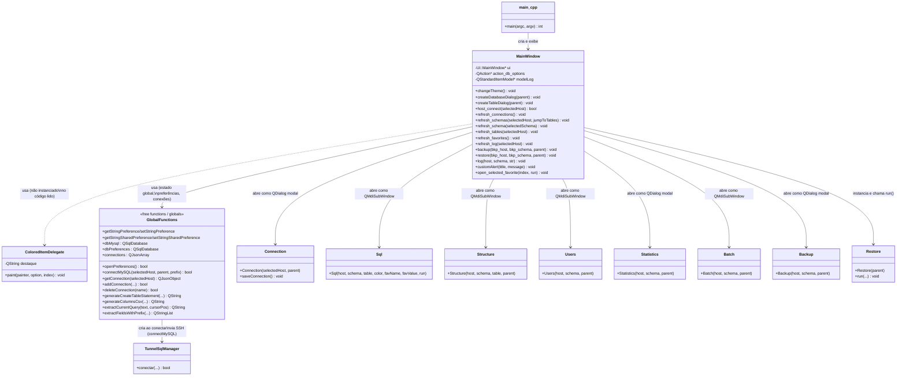
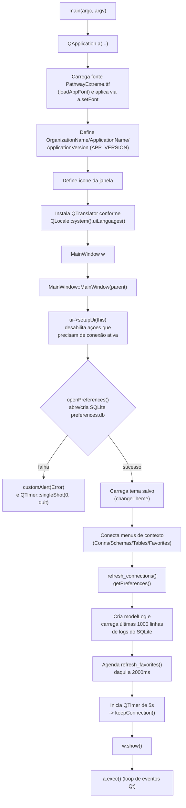
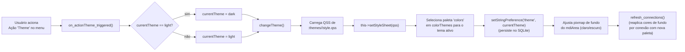

# Núcleo da Aplicação (MainWindow, main, functions)

## Visão Geral

Este subsistema é o "shell" da aplicação SequelFast: o ponto de entrada (`src/main.cpp`), a janela principal MDI (`MainWindow`, em `src/mainwindow.h/.cpp`) e um módulo de funções utilitárias globais com estado compartilhado (`src/functions.h/.cpp`).

`main.cpp` monta o `QApplication`, carrega fonte customizada, define nome/organização/versão da aplicação, instala tradutor de idioma (i18n) e instancia/exibe a `MainWindow`.

`MainWindow` é a classe orquestradora de todo o app: ela não implementa lógica de negócio de SQL, backup, estrutura de tabela, etc. — ela apenas gerencia a interface principal (toolbox de conexões/schemas/tabelas/favoritos, menus, toolbar, log de queries, tema visual) e instancia as janelas de funcionalidade (`Connection`, `Sql`, `Structure`, `Users`, `Statistics`, `Batch`, `Backup`, `Restore`) como sub-janelas MDI (`QMdiSubWindow`) dentro do `QMdiArea` central (`ui->mdiArea`), ou como diálogos modais.

`functions.h/.cpp` concentra estado global (variáveis `extern`/globais, como `connections`, `dbMysql`, `dbPreferences`, `actual_host`, `actual_schema`, `currentTheme`, etc.) e funções livres para: persistência de preferências e conexões em um banco SQLite local (`preferences.db`, via driver `QSQLITE`), abertura de conexões MySQL/MariaDB (incluindo túnel SSH via `TunnelSqlManager`), e utilitários de parsing/geração de SQL usados pelo editor. Não existe uma classe "Settings" ou "ConnectionManager" dedicada — tudo é acessado através dessas funções globais e variáveis `extern`, um padrão que se repete em todo o projeto (mainwindow.cpp, sql.cpp, connection.cpp etc. todos incluem `functions.h` e leem/escrevem as mesmas globais).

## Diagrama de Classes



## Referência de API

### class MainWindow

`MainWindow` herda de `QMainWindow` e usa um `Ui::MainWindow* ui` gerado a partir do `.ui` (Qt Designer). Não há evidência no código de que `ColoredItemDelegate` seja de fato atribuído a alguma view via `setItemDelegate` dentro do trecho lido de `mainwindow.cpp` — ela está declarada no header junto da `MainWindow`, mas seu uso efetivo não foi encontrado nos arquivos analisados.

#### Métodos públicos

| Assinatura | Descrição |
|---|---|
| `MainWindow(QWidget* parent = nullptr)` | Construtor. Configura a UI, aplica tema salvo, conecta menus de contexto, carrega o log de queries (até 1000 últimas linhas) do SQLite de preferências, agenda `refresh_favorites()` após 2s (`QTimer::singleShot`) e inicia um `QTimer` de 5s que chama `keepConnection()` para manter a conexão MySQL ativa. |
| `~MainWindow()` | Destrutor; apenas `delete ui`. |
| `void changeTheme()` | Lê `currentTheme` (global) e carrega o QSS correspondente de `:themes/<tema>/<tema>style.qss` (recurso Qt), aplica como stylesheet da janela, seleciona a paleta de cores (`colorThemes`) do tema ativo, persiste a preferência (`setStringPreference("theme", ...)`) e ajusta o padrão de fundo do `mdiArea` (pixmap 10x10 pontilhado, cinza-escuro no dark, branco no light). |
| `void createDatabaseDialog(QWidget* parent)` | Abre um `QDialog` (montado na hora, com `QFormLayout`) pedindo nome/charset/collation e executa `CREATE DATABASE`. Em sucesso, chama `refresh_schemas`. |
| `void createTableDialog(QWidget* parent)` | Abre diálogo simples pedindo nome de tabela e executa `CREATE TABLE <nome> (id INT AUTO_INCREMENT PRIMARY KEY)`. Em sucesso, chama `refresh_tables`. |
| `bool host_connect(QString selectedHost)` | Chama `connectMySQL` (função global) e depois confere `dbMysql.open()`; em sucesso chama `refresh_schemas(selectedHost, true)`. Retorna `false` em falha de conexão. |
| `void refresh_connections()` | Recarrega o `QListView` de conexões a partir do array global `connections` (JSON), com ícone e cor de fundo por conexão; detecta conexão marcada como `shared` (favoritos compartilhados) e guarda em `sharedFavoriteDB`. |
| `void refresh_schemas(QString selectedHost, bool jumpToTables)` | Executa `SHOW DATABASES` na conexão ativa e popula a lista de schemas, filtrando/destacando schemas de sistema (`_SequelFast`, `mysql`, `information_schema`, `performance_schema`, `sys`) com ícone diferente. Se `jumpToTables` for `true`, chama `refresh_tables`. |
| `void refresh_schema(QString selectedSchema)` | Executa `USE <schema>` na conexão ativa e, em sucesso, chama `refresh_tables` e muda a aba ativa do `toolBoxLeft` para a de tabelas (índice 2). |
| `void refresh_tables(QString selectedHost)` | Executa `SHOW TABLES` e popula a lista de tabelas. |
| `void refresh_favorites()` | Recarrega a árvore de favoritos (`treeViewFavorites`) com três grupos: "Local" (favoritos salvos no SQLite local, prefixo de nome `fav^...`), "Shared" (favoritos gravados na tabela `_SequelFast.prefs` de um MySQL remoto configurado como `shared`) e um grupo com o nome do usuário do SO (favoritos privados dentro do compartilhado, filtrados por usuário). Cria a base/tabela `_SequelFast` remotamente se não existir. |
| `void refresh_log(QString selectedHost)` | **Observação:** o corpo é praticamente idêntico ao de `refresh_tables` (executa `SHOW TABLES` contra `pref_connection`, não contra logs) — parece código copiado/colado sem terminar a adaptação; não lê de fato a tabela `logs`. Ver seção de Observações. |
| `void startSSH(QString& selectedHost)` | Declarado no header, **sem implementação encontrada** em `mainwindow.cpp` nem em nenhum outro `.cpp` do projeto. Não é chamado em nenhum lugar. |
| `void endSSH(QString& selectedHost)` | Mesma situação de `startSSH`: declarado, não implementado, não referenciado. |
| `void customAlert(QString title, QString message)` | Exibe um `QMessageBox` estilizado (padding/min-size via stylesheet inline) com botão OK. |
| `void open_selected_favorite(const QModelIndex& index, const bool& run)` | Localiza o registro do favorito clicado (usando os arrays paralelos `favName`/`favValue`, parseando por `^`) e abre uma nova sub-janela `Sql` (MDI) já carregada com host/schema/tabela/cor daquele favorito; se `run == true`, a query é executada automaticamente ao abrir. |
| `void backup(const QString& bkp_host, const QString& bkp_schema, QWidget* parent)` | Abre o diálogo `Backup` (modal) e, ao fechar, chama `refresh_schemas`. |
| `void restore(const QString& bkp_host, const QString& bkp_schema, QWidget* parent)` | Instancia `Restore` e chama `executor.run("", "mysql_connection_", bkp_host, bkp_schema, this)`, depois `refresh_schemas`. |
| `void log(QString host, QString schema, QString str)` | Adiciona uma linha ao `modelLog` (exibido em `tableLogView`) e persiste a query executada na tabela `logs` do SQLite de preferências. É o sumidouro central do log de atividade SQL da aplicação (chamado por outras classes, ex. `Sql`, ao executarem queries). |

#### Slots privados relevantes (`private slots`)

| Slot | Gatilho / Propósito |
|---|---|
| `keepConnection()` | Disparado por `QTimer` a cada 5s; se há `actual_host` ativo, executa `SELECT 1` na conexão MySQL correspondente para evitar timeout/desconexão por inatividade. |
| `on_buttonNewConns_clicked()` | Delegado para `on_actionNew_connection_triggered()`. |
| `on_buttonFilterSchemas_clicked()` / `on_buttonFilterTables_clicked()` / `on_buttonFilterFavorites_clicked()` | Alternam um "favorito de filtro" persistido (`fav_<host>`, `fav_<host>_<schema>`, `fav_fav`) que pré-preenche a caixa de busca correspondente quando reativado. |
| `on_buttonEditConns_clicked()` / `on_buttonEditTables_clicked()` / `on_buttonEditSchemas_clicked()` / `on_buttonEditFavorites_clicked()` | Alternam o modo "edição" das respectivas listas (ícone muda) e forçam um `refresh_*`. |
| `on_buttonUpdateSchemas_clicked()` / `on_buttonUpdateTables_clicked()` / `on_buttonUpdateFavorites_clicked()` | Forçam recarregamento manual das listas. |
| `on_toolBoxLeft_currentChanged(int index)` | Ajusta foco de teclado para a `QListView` correspondente à aba ativa (0=conexões, 1=schemas, 2=tabelas). |
| `on_actionQuit_triggered()` | Fecha `dbMysql` e `dbPreferences`, fecha a janela. |
| `on_actionNew_connection_triggered()` | Gera nome único ("New connection", "New connection 1", ...), cria registro via `addConnection`, abre `Connection` como diálogo modal; repete em loop até conseguir criar (ver Observações — risco de loop infinito). |
| `on_actionTile_triggered()` / `on_actionCascade_triggered()` | Organizam as sub-janelas do `mdiArea` (`tileSubWindows()` / `cascadeSubWindows()`). |
| `on_listViewConns_clicked/doubleClicked` | Habilita ações de menu (New schema, Users, Restore); duplo-clique abre ou edita a conexão dependendo do estado do botão "Editar Conexões". |
| `on_listViewSchemas_clicked/doubleClicked` | Clique simples busca tamanho/qtd. de tabelas do schema via `information_schema.TABLES`; duplo-clique executa `USE` no schema e navega para tabelas. |
| `on_listViewTables_clicked/doubleClicked` | Clique simples busca linhas/tamanho da tabela via `information_schema.tables`; duplo-clique abre `Sql` ou `Structure` conforme modo "Editar Tabelas". |
| `listViewConns_open/edit/clone/remove` | Ações de conexão reutilizadas tanto pelo duplo-clique quanto pelo menu de contexto. |
| `show_context_menu_Conns/Schemas/Tables/Favorites(QPoint)` | Constroem e exibem `QMenu` de contexto (Open/Edit/Clone/Remove/Batch run; Create/Drop/Refresh/Users/Statistics/Backup/Restore; Copy as SQL/CSV; etc.), com confirmação via `QMessageBox` para operações destrutivas (Drop database/table, Delete favorite). |
| `handleListViewTables_open/edit(QModelIndex)` | Abrem, respectivamente, uma janela `Sql` ou `Structure` como sub-janela MDI para a tabela selecionada. |
| `on_actionTheme_triggered()` | Alterna `currentTheme` entre "light"/"dark", chama `changeTheme()` e `refresh_connections()`. |
| `on_actionNew_schema_triggered()` / `on_actionNew_table_triggered()` | Abrem os diálogos de criação (apenas se `actual_host` estiver definido). |
| `on_actionUsers_triggered()` | Abre `Users` como sub-janela MDI. |
| `batch_run()` | Abre `Batch` como sub-janela MDI. |
| `on_treeViewFavorites_clicked/doubleClicked` | Duplo-clique abre o favorito (executando a query se o modo "Editar Favoritos" estiver desligado). |
| `on_actionBackup_triggered()` / `on_actionRestore_triggered()` | Chamam `backup()`/`restore()` com `actual_host`/`actual_schema` correntes. |
| `on_actionStatistics_triggered()` | Abre `Statistics` como diálogo modal. |
| `on_buttonDeleteLog_clicked()` | Confirma via `QMessageBox` e, se sim, limpa `modelLog` e apaga todas as linhas da tabela `logs` no SQLite (`DELETE FROM logs` sem filtro). |

#### Membros de estado importantes

| Membro | Tipo | Observação |
|---|---|---|
| `ui` | `Ui::MainWindow*` | Ponteiro para a UI gerada pelo Designer; acesso a todos os widgets (`ui->mdiArea`, `ui->listViewConns`, `ui->toolBoxLeft`, `ui->tableLogView`, etc.). |
| `modelLog` | `QStandardItemModel*` | Modelo com 4 colunas (Date/Host/Schema/Query) por trás de `ui->tableLogView`, exposto via `QSortFilterProxyModel` para permitir filtro de texto livre. |
| `action_db_options` | `QAction*` | Declarado como membro privado, mas **nenhuma atribuição ou uso foi encontrado** em `mainwindow.cpp` — aparenta ser membro morto/planejado e não finalizado. |
| `newConnectionCount` (global do arquivo, não da classe) | `int` | Contador usado para gerar nomes únicos de nova conexão / clone. |
| `favName` / `favValue` (globais do arquivo) | `QStringList` | Arrays paralelos que espelham as chaves/valores de favoritos carregados por `refresh_favorites()`; usados por índice em várias operações (abrir, renomear, clonar, excluir favorito) — acoplamento por posição em vez de por identificador estável. |

### funções livres em functions.h/.cpp

Estado global relevante declarado/definido em `functions.cpp` (não em `functions.h`, mas usado via `extern` por `mainwindow.cpp` e outros arquivos): `connections` (QJsonArray de conexões carregadas do SQLite), `colors`/`colorThemes` (paletas por tema), `dbPreferences` (QSqlDatabase SQLite local), `dbMysql` (QSqlDatabase MySQL "atual"), `currentTheme`, `actual_host`/`actual_schema`/`actual_table`/`actual_color` (contexto de navegação atual), `sharedFavoriteDB`, `prefLoaded`, `sshPort` (fixo em 3307), e preferências numéricas (`pref_sql_limit`, `pref_table_row_height`, `pref_table_font_size`, `pref_sql_font_size`).

| Assinatura | Propósito |
|---|---|
| `bool openPreferences()` | Abre (criando se necessário) o SQLite `preferences.db` em `AppDataLocation`; cria as tabelas `conns`, `prefs` e `logs` se não existirem; popula uma conexão padrão "Localhost" (127.0.0.1:3306/root) na primeira execução; preenche 4 preferências padrão (`sql_limit`, `table_row_height`, `table_font_size`, `sql_font_size`); carrega todas as conexões salvas para o array global `connections`; garante preferência `fav_limit` = 500. Retorna `false` se não conseguir abrir o banco. |
| `QJsonObject getConnection(QString selectedHost)` | Busca no array global `connections` o objeto JSON cujo campo `name` bate com `selectedHost`. Retorna objeto vazio se não encontrado. |
| `bool addConnection(QString name, QString color = "", QString host = "", QString user = "", QString pass = "", QString port = "", QString ssh_host = "", QString ssh_user = "", QString ssh_pass = "", QString ssh_port = "", QString ssh_keyfile = "")` | Insere uma nova linha na tabela `conns` (SQLite) apenas se ainda não existir conexão com esse `name`; em sucesso, chama `openPreferences()` de novo para recarregar o array `connections`. |
| `bool deleteConnection(QString name)` | Remove a linha correspondente de `conns` e recarrega preferências. |
| `bool connMysql(QWidget* parent, QString selectedHost)` | **Declarada em `functions.h` mas sem implementação em `functions.cpp` (nem em nenhum outro arquivo do projeto)** — não é referenciada em lugar nenhum do código-fonte. Provável resquício de refatoração (substituída por `connectMySQL`). |
| `void updateIntPreference(QString name, int value)` | Faz upsert manual (SELECT + UPDATE/INSERT) de uma preferência inteira na tabela `prefs`. |
| `int getIntPreference(QString name)` | Lê valor inteiro de `prefs`; retorna `0` se não encontrado. |
| `QString getStringPreference(QString name)` | Lê valor string de `prefs`; retorna `""` se não encontrado. |
| `QString setStringPreference(QString name, QString value)` | Upsert de preferência tipo string em `prefs` (SQLite local). Usada também para persistir favoritos "Local" (nome da preferência é a própria chave composta do favorito, prefixo `fav^`). |
| `QString getStringSharedPreference(QString name)` | Mesmo conceito, mas lendo de `_SequelFast.prefs` na conexão MySQL remota nomeada por `sharedFavoriteDB` (favoritos compartilhados entre usuários). No-op (retorna string vazia) se não há `sharedFavoriteDB` configurado. |
| `QString setStringSharedPreference(QString name, QString value)` | Upsert equivalente ao anterior, mas no MySQL remoto compartilhado. |
| `void getPreferences()` | Carrega as 4 preferências numéricas globais (`pref_sql_limit`, `pref_table_row_height`, `pref_table_font_size`, `pref_sql_font_size`) a partir do SQLite. |
| `void updatePreferences()` | Persiste de volta as mesmas 4 preferências numéricas. |
| `QString getRgbFromColorName(const QString& colorName)` | Traduz um nome de cor lógico (ex.: "blue", "grey") para o código RGB do tema ativo, usando o array `colors` (já filtrado por tema em `changeTheme()`); retorna `"#FFFFFF"` se não encontrado. |
| `QStringList extractFieldsWithPrefix(const QStringList& fields, const QString& tableName, const QString& alias)` | Dado uma lista de campos (possivelmente prefixados com `tabela.campo` ou `alias.campo`), retorna apenas os nomes de campo (sem prefixo) que pertencem à tabela/alias informado; campos sem prefixo são assumidos como pertencentes à tabela principal. Usado no editor SQL para lidar com JOINs. |
| `QString extractCurrentQuery(const QString& text, int cursorPos)` | Dado o texto completo do editor SQL e a posição do cursor, isola e retorna apenas a instrução delimitada por `;` em que o cursor está posicionado (permite executar "a query atual" em um editor com múltiplas instruções separadas por `;`). |
| `bool connectMySQL(const QString selectedHost, QObject* parent = nullptr, const QString prefix = "mysql_connection_")` | Função central de conexão MySQL/MariaDB: reaproveita conexão `QSqlDatabase` já aberta com o nome `prefix+selectedHost` se existir; caso contrário cria uma nova via driver `QMYSQL`. Se a conexão tiver `ssh_host` configurado, delega a abertura para `TunnelSqlManager::conectar(...)` (túnel SSH antes do MySQL); caso contrário configura host/schema/porta/usuário/senha diretamente. Usa `QApplication::setOverrideCursor(Qt::WaitCursor)` durante a operação. Atualiza a global `dbMysql` para a conexão resultante. |
| `QString generateCreateTableStatement(const QString& tableName, const QString& connectionName)` | Executa `SHOW CREATE TABLE` na conexão informada e retorna a coluna 1 do resultado (o DDL completo). Usado por "Copy as SQL" no menu de contexto de tabelas. |
| `QString generateColumnsCsv(const QString& tableName, const QString& connectionName)` | Executa `DESCRIBE <tabela>` e monta um CSV (`Field,Type,Default`) com escaping de aspas. Usado por "Copy as CSV". |
| `QString getUserName()` | Deriva o "nome de usuário" a partir do nome do diretório home do SO (`QStandardPaths::HomeLocation`), com a primeira letra maiúscula. Usado para segmentar favoritos compartilhados privados por usuário (grupo pessoal na árvore de favoritos). |

## Fluxos Principais

### 1. Inicialização da aplicação



### 2. Abertura de uma sub-janela MDI (exemplo: abrir tabela em editor SQL)

```mermaid
sequenceDiagram
    participant U as Usuário
    participant MW as MainWindow
    participant F as functions.cpp
    participant DB as MySQL (QSqlDatabase)
    participant S as Sql (QMainWindow)

    U->>MW: duplo-clique em tabela\n(listViewTables)
    MW->>MW: on_listViewTables_doubleClicked(index)
    alt buttonEditTables marcado
        MW->>MW: handleListViewTables_edit(index)
        MW->>MW: new Structure(host, schema, table)
    else modo normal
        MW->>MW: handleListViewTables_open(index)
        MW->>S: new Sql(actual_host, actual_schema,\nactual_table, actual_color, "", "", true)
        S->>F: connectMySQL(host) [se necessário]
        F->>DB: abre/reaproveita QSqlDatabase\n"mysql_connection_<host>"
        S->>S: monta e executa SELECT inicial\n(via editor SQL)
    end
    MW->>MW: verifica sub-janela ativa\n(maximizada? -> maximize=true/false)
    MW->>MW: new QMdiSubWindow; sub->setWidget(form)
    MW->>MW: sub->setAttribute(Qt::WA_DeleteOnClose)
    MW->>MW: ui->mdiArea->addSubWindow(sub)
    MW->>MW: sub->resize(500,360)
    alt maximize == true
        MW->>MW: sub->showMaximized()
    else
        MW->>MW: sub->show()
    end
```

### 3. Troca de tema (light/dark)



## Observações de Implementação

- **`connMysql` (functions.h) está declarada mas nunca implementada nem chamada** em todo o código-fonte pesquisado — provável resíduo de refatoração para `connectMySQL`. Se algum código futuro chamar `connMysql`, haverá erro de linkedição.
- **`MainWindow::startSSH` e `MainWindow::endSSH`** estão declarados no header, mas não têm implementação em `mainwindow.cpp` nem em nenhum outro arquivo — não são chamados por ninguém. A lógica de SSH efetivamente usada está em `connectMySQL` (functions.cpp), que delega para `TunnelSqlManager::conectar(...)`.
- **`MainWindow::refresh_log(QString selectedHost)`** parece incompleto/copiado de `refresh_tables`: executa `SHOW TABLES` contra a conexão `pref_connection` (SQLite) em vez de consultar a tabela `logs`; não usa o parâmetro `selectedHost`. O carregamento real do log (últimas 1000 linhas) acontece apenas uma vez, no construtor da `MainWindow`, não nesta função.
- **`action_db_options` (QAction*)** é membro privado declarado mas nunca atribuído/usado em `mainwindow.cpp` — possivelmente planejado para um menu de opções de banco de dados ainda não implementado.
- **`ColoredItemDelegate`**, apesar de definida logo após `MainWindow` no header, não teve nenhum ponto de `setItemDelegate(...)` encontrado nos arquivos lidos — pode estar em uso em algum outro `.cpp` não coberto por este documento, ou ser código morto.
- **`InterruptibleProgressDialog`** é definida como `struct` local em `mainwindow.cpp` (linhas 39-60) mas nunca instanciada nesse arquivo — existe uma classe homônima e com propósito idêntico em `src/restore.cpp`, efetivamente usada lá. A definição em `mainwindow.cpp` parece código morto/duplicado.
- **Estado global compartilhado via `extern`** (`dbMysql`, `actual_host`, `actual_schema`, `actual_table`, `actual_color`, `connections`, etc.) é o mecanismo central de comunicação entre `MainWindow` e as demais janelas (`Sql`, `Structure`, `Users`, etc.), em vez de injeção de dependência ou passagem explícita de um contexto/serviço. Isso implica que só existe "uma conexão MySQL ativa por vez" do ponto de vista dessas globais, mesmo que múltiplas sub-janelas MDI (potencialmente de hosts diferentes) estejam abertas simultaneamente — o valor de `dbMysql`/`actual_host` reflete apenas a última navegação feita na árvore esquerda, não necessariamente a sub-janela em foco.
- **Favoritos identificados por string composta e por índice posicional**: a chave de um favorito é uma string única `fav^host^schema^table^color^nome[^usuário]`, e o código correlaciona a entrada selecionada na UI com os arrays paralelos `favName`/`favValue` fazendo split por `^` e comparação de substring — não há um identificador estável (ID numérico), o que é frágil a colisões de nome e exige recarregar tudo (`refresh_favorites()`) após qualquer alteração.
- **Tratamento de erros é majoritariamente "best-effort" via `qDebug`/`qWarning`/`qCritical` e `customAlert`**, sem exceções C++; falhas de `query.exec(...)` em geral apenas logam e seguem em frente (ex.: em `refresh_schemas`, se a `QSqlQuery` falha, apenas restaura o cursor sem mensagem ao usuário).
- **`on_actionNew_connection_triggered()`** roda um `while (!fez)` que só termina quando `addConnection` retorna `true`; como `addConnection` falha apenas se já existir uma conexão com aquele nome exato, e o nome é gerado incrementando `newConnectionCount`, o loop sempre converge — mas não há limite máximo de tentativas nem tratamento de falha de banco (se `openPreferences`/SQLite falhar de outra forma, o loop pode não ter como sair).
- **Criação de banco de favoritos compartilhados (`_SequelFast`) é implícita**: ao detectar uma conexão marcada `shared=1`, `refresh_favorites()` cria automaticamente o schema `_SequelFast` e a tabela `prefs` no servidor remoto se não existirem — efeito colateral automático de uma simples atualização de UI, sem confirmação do usuário.
- **`main.cpp`** contém código comentado (fonte "Gilroy.otf" alternativa) e usa a macro `APP_VERSION`, que **não** vem de `functions.h` (lá há apenas uma linha comentada `// #define APP_VERSION "0.1.0"`, além de `APP_BUILD_DATE`/`APP_BUILD_TIME` que são `#define`d de fato) — `APP_VERSION` é injetada via `qmake` a partir da variável `VERSION` do próprio `SequelFast.pro` (`DEFINES += APP_VERSION=\"$$VERSION\"`), ou seja, o número de versão do app é definido em um único lugar no `.pro`.
