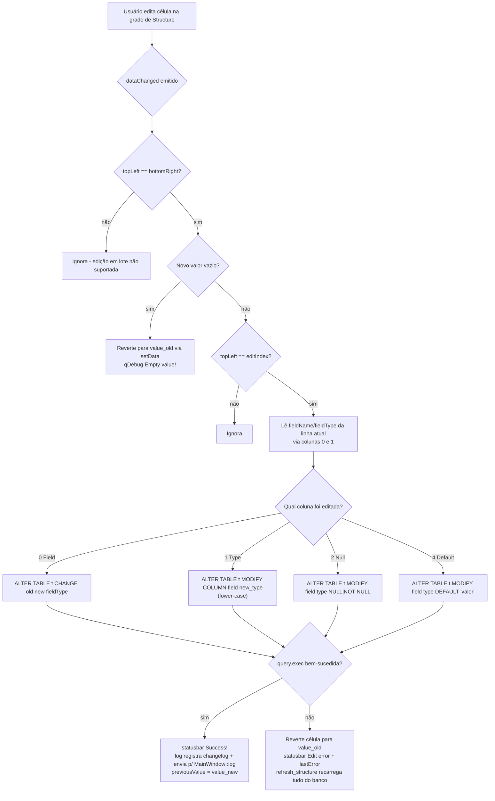
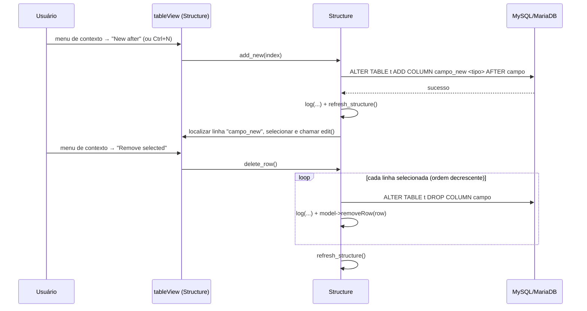
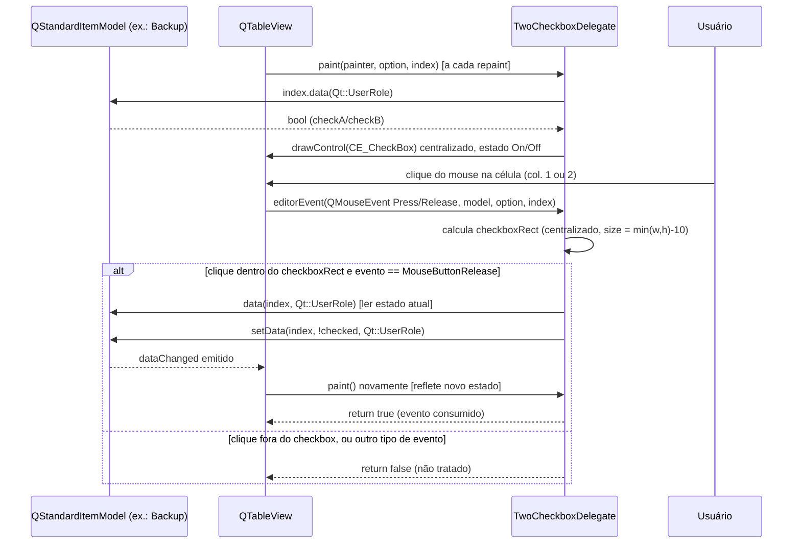

# Estrutura de Tabelas e Delegates (Structure, TwoCheckboxDelegate, TwoCheckboxListModel)

## Visão Geral

Este subsistema cobre a janela de edição de estrutura de tabela (`Structure`, em
`src/structure.h`/`src/structure.cpp`) e os *delegates* de célula reutilizáveis usados
para restringir/facilitar a edição em `QTableView`s do projeto:

- **`Structure`** (`QMainWindow`) — abre uma janela MDI-filha que executa `DESCRIBE <tabela>`
  no schema/host selecionado, exibe o resultado em um `QTableView` editável (colunas
  `Field`, `Type`, `Null`, `Key`, `Default`, `Extra`) e traduz edições de célula em
  comandos `ALTER TABLE` imediatos contra o MySQL/MariaDB. Mantém também um changelog
  (`tableLog`) de todas as alterações feitas na sessão.
- **`RegexDelegateName` / `RegexDelegateType` / `RegexDelegateYesNo`** — três delegates
  privados, definidos no topo de `src/structure.cpp` (não têm `.h` próprio, são de uso
  interno do arquivo), que implementam a "validação de tipos de coluna" mencionada no
  `CLAUDE.md` do projeto ("Multiple regex-based delegates for table structure editing").
  Cada um restringe o editor de texto de uma coluna específica da grade de estrutura via
  `QRegularExpressionValidator` e, em dois casos, oferece autocompletar (`QCompleter`).
- **`TwoCheckboxDelegate`** (`src/two_checkbox_delegate.h/.cpp`) — delegate genérico de
  `QStyledItemDelegate` que desenha e trata cliques de checkbox nas colunas 1 e 2 de um
  `QTableView`, usado atualmente pela tela de **Backup** (`src/backup.h/.cpp`, colunas
  "Structure" e "Data" da lista de tabelas a exportar) — não pela `Structure`.
- **`TwoCheckboxListModel`** (`src/two_checkbox_list_model.h`) — `QAbstractListModel`
  companheiro, pensado para alimentar uma `QListView`/`QTableView` com itens que possuem
  rótulo (`label`) e dois estados booleanos (`checkA`, `checkB`), reaproveitando a struct
  `ItemData` declarada em `src/backup.h`.

Observação importante encontrada na leitura do código: **`TwoCheckboxListModel` está
definido mas não é instanciado em nenhum lugar do código-fonte atual** (`grep` por `new
TwoCheckboxListModel` não retorna ocorrências). O uso real em `Backup` (linhas
145-171 de `src/backup.cpp`) é feito com um `QStandardItemModel` comum, armazenando os
dois estados de checkbox via `Qt::UserRole` diretamente nos itens — ou seja, o par
model/delegate "oficial" hoje é `QStandardItemModel` + `TwoCheckboxDelegate`, e
`TwoCheckboxListModel` parece ser uma abstração alternativa ainda não adotada (código
morto ou preparação para refatoração futura). Isso é dito explicitamente aqui porque
não há certeza sobre a intenção — apenas o fato observável de que a classe não é usada.

## Diagrama de Classes

```mermaid
classDiagram
    class QMainWindow
    class QStyledItemDelegate
    class QAbstractListModel

    class Structure {
        -Ui::Structure* ui
        -QSqlDatabase dbMysqlLocal
        -QStandardItemModel* modelLog
        -QString str_host
        -QString str_schema
        -QString str_table
        -QModelIndex editIndex
        -QVariant previousValue
        -int logCount
        +Structure(host, schema, table, parent)
        +refresh_structure() void
        +log(name, what, value_from, value_to, str) void
        -on_tableData_changed(topLeft, bottomRight) void
        -show_context_menu(pos) void
        -add_new(index) void
        -delete_row() void
        -on_buttonUpdateFields_clicked() void
    }
    QMainWindow <|-- Structure

    class RegexDelegateName {
        +createEditor(parent, option, index) QWidget*
    }
    class RegexDelegateType {
        +createEditor(parent, option, index) QWidget*
    }
    class RegexDelegateYesNo {
        +createEditor(parent, option, index) QWidget*
    }
    QStyledItemDelegate <|-- RegexDelegateName
    QStyledItemDelegate <|-- RegexDelegateType
    QStyledItemDelegate <|-- RegexDelegateYesNo

    class TwoCheckboxDelegate {
        +TwoCheckboxDelegate(parent)
        +paint(painter, option, index) void
        +editorEvent(event, model, option, index) bool
    }
    QStyledItemDelegate <|-- TwoCheckboxDelegate

    class TwoCheckboxListModel {
        +QVector~ItemData~ items
        +rowCount(parent) int
        +data(index, role) QVariant
        +setData(index, value, role) bool
        +flags(index) Qt::ItemFlags
    }
    QAbstractListModel <|-- TwoCheckboxListModel

    class ItemData {
        +QString label
        +bool checkA
        +bool checkB
    }
    TwoCheckboxListModel *-- ItemData : items

    Structure ..> RegexDelegateName : setItemDelegateForColumn("Field")
    Structure ..> RegexDelegateType : setItemDelegateForColumn("Type")
    Structure ..> RegexDelegateYesNo : setItemDelegateForColumn("Null")

    class Backup {
        -TwoCheckboxDelegate* checkboxDelegate
        -QStandardItemModel* model
    }
    Backup ..> TwoCheckboxDelegate : setItemDelegateForColumn(1,2)
    Backup ..> QStandardItemModel : usa Qt::UserRole p/ checkA/checkB
    note for TwoCheckboxListModel "Definido em two_checkbox_list_model.h,\nmas sem instanciação (new) encontrada\nem nenhum .cpp do projeto (código não utilizado hoje)."
```

## Referência de API

### `Structure` (`src/structure.h`, `src/structure.cpp`)

| Método | Descrição |
|---|---|
| `Structure(QString& host, QString& schema, QString& table, QWidget* parent = nullptr)` | Construtor. Guarda host/schema/tabela, reutiliza a conexão global `dbMysql` (extern), monta a UI, chama `refresh_structure()`, cria o `modelLog` do changelog e conecta o menu de contexto. Usa `QTimer::singleShot(0, ...)` para redimensionar o `QSplitter` (70%/30%) só após o layout ter tamanho real. |
| `~Structure()` | Destrói `ui`. |
| `void refresh_structure()` | Slot/método público. Executa `USE <schema>` e `DESCRIBE <tabela>` na conexão nomeada `"mysql_connection_" + str_host`, recria o `QStandardItemModel` da grade (`ui->tableView`), reaplica os delegates por nome de coluna e reconecta os sinais `currentChanged`/`dataChanged`. É chamado no construtor, após cada `ALTER TABLE` malsucedido (para descartar a edição), após `add_new` e após `delete_row`. |
| `void log(QString name, QString what, QString value_from, QString value_to, QString str)` | Adiciona uma linha ao `modelLog` (grade de changelog `ui->tableLog`) com o nome do campo, o tipo de operação, valor antigo/novo, rola/seleciona a última linha, e repassa a string SQL (`str`) para `MainWindow::log(host, schema, str)` via `qobject_cast<MainWindow*>(this->window())`. |

| Slot privado | Descrição |
|---|---|
| `on_tableData_changed(topLeft, bottomRight)` | Conectado a `dataChanged` do model da grade. Ignora seleções múltiplas (`topLeft != bottomRight`). Se o novo valor for vazio, reverte. Caso contrário, monta e executa o `ALTER TABLE` correspondente à coluna editada (ver seção de fluxos). |
| `show_context_menu(pos)` | Slot do `customContextMenuRequested` do `tableView`. Monta um `QMenu` com "New after", "Remove selected", "Move up", "Move down" e registra um `QShortcut` persistente (`Ctrl+N`/`Cmd+N`) para `add_new`. |
| `add_new(index)` | Executa `ALTER TABLE ... ADD COLUMN <campo>_new <mesmo tipo do campo de referência> AFTER <campo>`, registra no log, chama `refresh_structure()` e localiza/seleciona/abre para edição a nova coluna criada. |
| `delete_row()` | Para cada linha selecionada (deduplicada, processada em ordem decrescente de índice), executa `ALTER TABLE ... DROP COLUMN <campo>`, loga, remove a linha do model visual e ao final chama `refresh_structure()`. |
| `on_buttonUpdateFields_clicked()` | Slot Qt-autoconectado (`on_<objeto>_<sinal>`) do botão de refresh manual da UI; apenas chama `refresh_structure()`. |

Atributos relevantes: `editIndex` (índice da célula atualmente "armada" para commit) e
`previousValue` (valor anterior da célula, usado tanto para montar o `ALTER TABLE` quanto
para reverter em caso de erro) são preenchidos no slot `currentChanged` da seleção
(conectado dentro de `refresh_structure()`), não no `dataChanged`.

### Delegates regex internos de `src/structure.cpp` (sem cabeçalho próprio)

| Classe | Coluna aplicada | Comportamento do `createEditor` |
|---|---|---|
| `RegexDelegateName` | `Field` | `QLineEdit` com validador `^[a-zA-Z0-9_]*$` (nome de coluna: apenas alfanumérico e `_`). |
| `RegexDelegateType` | `Type` | `QLineEdit` com validador de tipo SQL (`nome(precisão,escala)? modificadores*`, ex.: `varchar(100)`, `decimal(10,2) unsigned`), força texto em minúsculas conforme o usuário digita, e oferece `QCompleter` com sugestões fixas de tipos comuns (`int`, `varchar(100)`, `text`, `datetime` etc.). |
| `RegexDelegateYesNo` | `Null` | `QLineEdit` restrito a `^yes$|^no$` (case-insensitive), força maiúsculas, com `QCompleter` oferecendo `YES`/`NO`. |

Nenhuma dessas três classes sobrescreve `setEditorData`/`setModelData`/`paint` — apenas
`createEditor`; o comportamento padrão de `QStyledItemDelegate` cuida do resto (ler/gravar
texto simples na coluna). Não há delegate dedicado para as colunas `Key`, `Default` ou
`Extra` — elas usam o delegate padrão do `QTableView` sem validação.

### `TwoCheckboxDelegate` (`src/two_checkbox_delegate.h/.cpp`)

| Método | Descrição |
|---|---|
| `explicit TwoCheckboxDelegate(QObject* parent = nullptr)` | Construtor trivial, repassa `parent` a `QStyledItemDelegate`. |
| `void paint(QPainter* painter, const QStyleOptionViewItem& option, const QModelIndex& index) const override` | Para colunas 1 e 2 (índice fixo, "structure" e "data" conforme o comentário da classe), desenha um `QStyle::CE_CheckBox` centralizado na célula (tamanho = menor dimensão da célula − 10px), com estado ligado/desligado lido de `index.data(Qt::UserRole)`. Para qualquer outra coluna, delega ao `QStyledItemDelegate::paint` padrão (texto). |
| `bool editorEvent(QEvent* event, QAbstractItemModel* model, const QStyleOptionViewItem& option, const QModelIndex& index) override` | Para colunas 1/2 e evento `QEvent::MouseButtonRelease` dentro do retângulo do checkbox, inverte o valor booleano armazenado em `Qt::UserRole` via `model->setData(index, !checked, Qt::UserRole)` e retorna `true` (evento consumido). Caso contrário retorna `false`. |

Não há `sizeHint` sobrescrito nem `setEditorData`/`setModelData` — não existe editor
"real" (widget) para essas colunas, toda a interação acontece dentro de `editorEvent` +
`paint`, um padrão comum para checkboxes desenhados manualmente em `QTableView`.

### `TwoCheckboxListModel` (`src/two_checkbox_list_model.h`)

| Método | Descrição |
|---|---|
| `int rowCount(const QModelIndex& parent = QModelIndex()) const override` | Retorna `items.size()`. |
| `QVariant data(const QModelIndex& index, int role) const override` | `Qt::DisplayRole` → `item.label`; `Qt::UserRole` → `item.checkA`; `Qt::UserRole + 1` → `item.checkB`; qualquer outro papel → `QVariant()` vazio. |
| `bool setData(const QModelIndex& index, const QVariant& value, int role) override` | Grava em `checkA` (`Qt::UserRole`) ou `checkB` (`Qt::UserRole + 1`); emite `dataChanged`; retorna `false` para papéis não suportados ou índice inválido/fora de faixa. |
| `Qt::ItemFlags flags(const QModelIndex& index) const override` | Sempre retorna `Qt::ItemIsEnabled | Qt::ItemIsSelectable | Qt::ItemIsEditable`, independente do índice ser válido. |
| Membro público `QVector<ItemData> items` | Armazenamento direto e público dos dados (sem getters/setters) — a struct `ItemData { QString label; bool checkA; bool checkB; }` está definida em `src/backup.h`. |

Signals/slots: `TwoCheckboxListModel` não declara sinais próprios; usa apenas os sinais
herdados de `QAbstractListModel` (`dataChanged`, emitido explicitamente em `setData`).
`TwoCheckboxDelegate` também não declara sinais/slots próprios — apenas sobrescreve os
dois métodos virtuais de `QStyledItemDelegate` mostrados acima.

## Fluxos Principais

### 1. Editar a estrutura de uma tabela (alterar campo até persistir via `ALTER TABLE`)



Observação sobre a coluna 3 (`Key`): não há `case 3` no `switch` de
`on_tableData_changed` — editar a coluna `Key` na grade não dispara nenhum `ALTER TABLE`
(mudança silenciosamente sem efeito no banco, embora a célula continue editável). A
coluna 5 (`Extra`) também não tem tratamento.

Fluxos irmãos de edição estrutural, fora do `switch` acima:



### 2. Interação do usuário com o `TwoCheckboxDelegate` numa célula da grade



Não existe editor de widget real criado (sem `createEditor` sobrescrito): todo o ciclo
"clique → alternância → repaint" acontece dentro de `editorEvent`/`paint`, sem abrir modo
de edição da célula. Isso significa que teclado (Espaço/Enter) não alterna o checkbox —
apenas clique do mouse dentro do retângulo desenhado é tratado.

## Observações de Implementação

- **Sem validação de driver/servidor antes do `ALTER TABLE`**: os métodos de
  `Structure` montam as strings SQL por concatenação direta (`"ALTER TABLE " + str_table +
  " CHANGE " + value_old + " " + value_new + ...`), sem escapar identificadores (sem
  backticks) nem usar bind parameters. A única barreira contra entradas inválidas é o
  `QRegularExpressionValidator` de `RegexDelegateName`/`RegexDelegateType`/
  `RegexDelegateYesNo` no momento da digitação — mas essa validação não cobre as colunas
  `Default` (case 4) nem `Key`/`Extra`, que aceitam qualquer texto livre.
- **Coluna `Key` (índice 3) sem efeito**: o `switch` de `on_tableData_changed` não tem
  `case 3`; editar essa célula na UI não gera nenhum comando SQL. Não fica claro no
  código se isso é intencional (chaves só deveriam ser geridas por outra tela) ou uma
  lacuna — vale confirmar com quem escreveu o código.
- **Changelog é apenas em memória/sessão**: `modelLog`/`log()` alimentam a grade
  `tableLog` e repassam a string SQL para `MainWindow::log(...)`, mas não há evidência,
  dentro de `structure.cpp`, de persistência própria do changelog em disco/banco — a
  persistência (se houver) depende inteiramente do que `MainWindow::log` fizer, que está
  fora do escopo lido aqui.
- **Reversão via `refresh_structure()` completo**: em qualquer falha de `ALTER TABLE`
  (exceto para adicionar/remover coluna, que já chama `refresh_structure()` sempre), o
  código primeiro tenta um `setData` reverso pontual e, na maioria dos casos, também
  chama `refresh_structure()` na sequência — ou seja, a UI é recarregada do zero do banco
  a cada erro, descartando qualquer outra edição pendente na grade.
  `add_new`/`delete_row` sempre recarregam a estrutura inteira ao final (sucesso ou não),
  o que é custoso para tabelas com muitas colunas mas garante consistência com o schema
  real.
- **Menu de contexto com itens não implementados**: "Move up" e "Move down" no menu de
  `show_context_menu` existem na UI mas os blocos `else if` correspondentes estão vazios
  (`// ...`), ou seja, atualmente não fazem nada — funcionalidade pendente, não um bug de
  uso.
- **`TwoCheckboxListModel` não é usado**: como destacado na Visão Geral, não há
  nenhuma instância de `TwoCheckboxListModel` em todo o código-fonte pesquisado; o único
  consumidor real de `TwoCheckboxDelegate` (`Backup`, em `src/backup.cpp` linhas
  145-171 e 535-536) usa um `QStandardItemModel` com dados de checkbox gravados em
  `Qt::UserRole` diretamente. Qualquer novo consumidor do "modelo dedicado" precisaria
  ligar `TwoCheckboxListModel` manualmente — hoje ele é código morto ou incompleto.
- **Coluna hardcoded no `TwoCheckboxDelegate`**: a detecção de quais colunas recebem
  checkbox é feita por índice fixo (`index.column() == 1 || index.column() == 2`), não
  por papel/flag do model. Isso acopla o delegate à ordem de colunas de quem o usa
  (atualmente `Backup`, colunas "Structure" e "Data"); reordenar colunas no consumidor
  quebra silenciosamente o delegate.
- **`RegexDelegateType` força minúsculas e `RegexDelegateYesNo` força maiúsculas**
  durante a digitação (via `connect(editor, &QLineEdit::textChanged, ...)`), mas o valor
  final gravado no model (`setModelData`, herdado do `QStyledItemDelegate` padrão) segue
  o texto do editor no momento em que a edição é commitada — não há normalização
  adicional depois de `on_tableData_changed` além do `.toLower()`/`.toUpper()` já feito
  ali mesmo antes de montar o `ALTER TABLE`.
