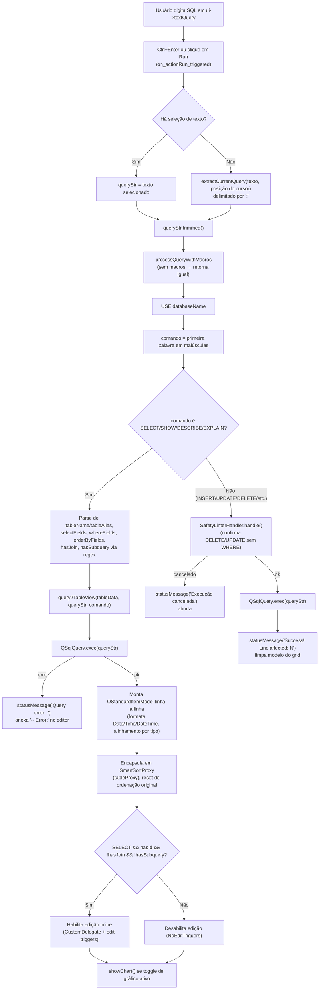
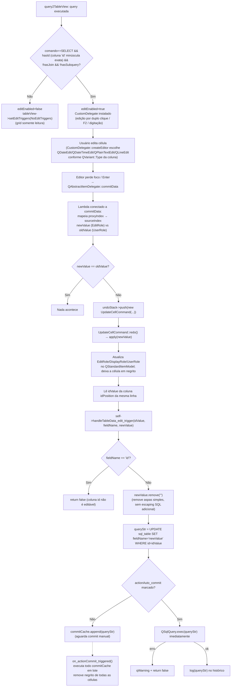

# Editor SQL (Sql, SqlHighlighter, TextEditCompleter, Macros)

## Visão Geral

O subsistema do editor SQL é o núcleo funcional do SequelFast. É implementado principalmente pela classe `Sql` (`src/sql.h` / `src/sql.cpp`), uma janela MDI (`QMainWindow`) que combina:

- um editor de texto (`ui->textQuery`, um `TextEditCompleter` com highlighting via `SqlHighlighter`) para escrever SQL;
- um grid de resultados (`ui->tableData`, um `QTableView`) alimentado por um `QStandardItemModel` encapsulado em um `QSortFilterProxyModel` customizado (`SmartSortProxy`), com edição inline opcional;
- um sistema de macros (`~campo`, `~campo@tipo`, `~campo@tipo~default`, `~campo@combo~tabela~chave~campoExibido~ordem`) que transforma a query digitada em um formulário de coleta de parâmetros antes da execução, implementado por `MacroInputDialog` (coleta de valores) e `MacroFormatDialog` (assistente para inserir a sintaxe da macro no texto);
- um timer de auto-execução (execução periódica da query N vezes a cada X segundos);
- comandos de manipulação de linhas do grid (append, clone, delete, copiar como INSERT/UPDATE/CSV) e um `QUndoStack` dedicado à edição de células, que também disparam `UPDATE`s reais no banco (ou os enfileiram em modo "commit manual");
- um gráfico de barras opcional (`showChart()`, Qt Charts) gerado a partir do resultado exibido (respeitando filtro e ordenação correntes).

Arquivos cobertos:
- `src/sql.h`, `src/sql.cpp` — classe `Sql` e classes auxiliares internas: `SmartSortProxy` (ordenação "tipada"), `CustomDelegate` (editores por tipo de coluna) e `UpdateCellCommand` (comando de undo/redo para edição de célula).
- `src/sqlhighlighter.h`, `src/sqlhighlighter.cpp` — `SqlHighlighter`, highlighting via regex.
- `src/texteditcompleter.h`, `src/texteditcompleter.cpp` — `TextEditCompleter`, um `QTextEdit` com autocompletar por palavra.
- `src/macroinputdialog.h`, `src/macroinputdialog.cpp` — `MacroInputDialog` e o struct `MacroField`.
- `src/macroformatdialog.h`, `src/macroformatdialog.cpp` — `MacroFormatDialog`.

Também são citados, por serem chamados diretamente pelo editor: `extractCurrentQuery`/`extractFieldsWithPrefix` (`src/functions.cpp`) e `SafetyLinterHandler` (`src/SafetyLinterHandler.h`), que confirma com o usuário `DELETE`/`UPDATE` sem `WHERE` antes de executar.

## Diagrama de Classes

```mermaid
classDiagram
    class Sql {
        -QSqlDatabase dbMysqlLocal
        -QCompleter* sqlCompleter
        -QSqlRecord currentRecord
        -QSortFilterProxyModel* tableProxy
        -QUndoStack* undoStack
        -QTimer* timer
        -bool editEnabled
        -bool hasId
        -bool hasJoin
        -bool hasSubquery
        -int idPosition
        -QStringList commitCache
        +query2TableView(QTableView*, QString queryStr, QString comando)
        +processQueryWithMacros(QString queryStr, QWidget* parent) QString
        +extractFields(QString queryStr) QVector~MacroField~
        +setupSqlCompleter()
        +formatSqlText()
        +showChart()
        +refresh_structure()
        +setInterfaceSize(int)
        -handleTableData_edit_trigger(QString&, QString&, QString&) bool
    }

    class SqlHighlighter {
        -QVector~Rule~ rules
        +SqlHighlighter(QTextDocument* parent)
        #highlightBlock(QString text)
    }

    class TextEditCompleter {
        -QCompleter* c
        +setCompleter(QCompleter*)
        +completer() QCompleter*
        #keyPressEvent(QKeyEvent*)
        #focusInEvent(QFocusEvent*)
        #canInsertFromMimeData(QMimeData*) bool
        #insertFromMimeData(QMimeData*)
        -insertCompletion(QString)
    }

    class MacroInputDialog {
        -QMap~QString,QWidget*~ inputs
        +MacroInputDialog(QVector~MacroField~ fields, QString host, QString schema, QWidget* parent)
        +getValues() QMap~QString,QVariant~
    }

    class MacroFormatDialog {
        -QString macroString
        +MacroFormatDialog(QWidget* parent)
        +resultMacro() QString
        -onTypeChanged(QString type)
    }

    class MacroField {
        <<struct>>
        +QString name
        +QString type
        +QString table
        +QString key
        +QString display
        +QString order
        +QString full
    }

    class SmartSortProxy {
        +setSqlRecord(QSqlRecord)
        #lessThan(QModelIndex, QModelIndex) bool
    }

    class CustomDelegate {
        +createEditor(...) QWidget*
        +setEditorData(...)
        +setModelData(...)
    }

    class UpdateCellCommand {
        +redo()
        +undo()
        -apply(QString value)
    }

    TextEditCompleter --|> QTextEdit
    SqlHighlighter --|> QSyntaxHighlighter
    SmartSortProxy --|> QSortFilterProxyModel
    CustomDelegate --|> QStyledItemDelegate
    UpdateCellCommand --|> QUndoCommand
    MacroInputDialog --|> QDialog
    MacroFormatDialog --|> QDialog

    Sql *-- TextEditCompleter : ui->textQuery
    Sql *-- SqlHighlighter : aplicado ao QTextDocument do textQuery
    Sql *-- SmartSortProxy : tableProxy
    Sql *-- UpdateCellCommand : undoStack (push por edição)
    Sql ..> CustomDelegate : cria em query2TableView quando edição habilitada
    Sql ..> MacroInputDialog : cria em processQueryWithMacros
    Sql ..> MacroFormatDialog : cria em on_actionMacros_triggered
    Sql ..> MacroField : produz via extractFields
    MacroInputDialog ..> MacroField : consome (1 widget por campo)
    UpdateCellCommand ..> Sql : friend class; chama handleTableData_edit_trigger
```

## Referência de API

### `Sql`

`Sql` não declara nenhum `signals:` próprio — toda a comunicação com `MainWindow` é feita chamando métodos do `MainWindow` obtido via `qobject_cast<MainWindow*>(this->window())` (ex.: `log(...)`, `refresh_favorites()`).

| Método público | Descrição |
|---|---|
| `Sql(const QString& host, const QString& schema, const QString& table, const QString& color, const QString& favName, const QString& favValue, const bool& run, QWidget* parent = nullptr)` | Constrói a janela. Se `favValue` não for vazio, a query e o schema vêm de um favorito (`favName` é uma string separada por `^`, índice `[5]` é o nome exibido); caso contrário, carrega a última query salva para `host^schema^table` das preferências, ou usa `SELECT * FROM table LIMIT N`. Se `run` for `true`, executa a query imediatamente. |
| `void query2TableView(QTableView* tableView, const QString& queryStr, const QString& comando)` | Executa `queryStr` e popula `tableView` com um `QStandardItemModel` (envolvido no `SmartSortProxy`). Decide se a edição inline deve ser habilitada. |
| `void setInterfaceSize(int increase)` | Ajusta fonte do editor/grid e altura de linha (`increase` > 0 aumenta, < 0 diminui, até limites de 6–30pt). Atualiza variáveis globais de preferência (`pref_sql_font_size`, `pref_table_font_size`, `pref_table_row_height`). |
| `void refresh_structure()` | Executa `DESCRIBE tabela` e monta um `QStandardItemModel` com colunas Field/Type/Null/Key/Default/Extra (o modelo é criado mas não é atribuído a nenhuma view visível no método — ver Observações). |
| `void formatSqlText()` | Formatação simples: insere quebra de linha antes de palavras-chave (`FROM`, `JOIN`s, `WHERE`, `ORDER`, `GROUP BY`, `LIMIT`) via regex e colapsa espaços múltiplos. |
| `QVector<MacroField> extractFields(const QString& queryStr)` | Faz o parsing de macros na query (ver seção Sistema de Macros). |
| `QString processQueryWithMacros(QString queryStr, QWidget* parent)` | Extrai as macros, exibe `MacroInputDialog` e substitui cada ocorrência pela string formatada. Retorna a query original inalterada se não houver macros ou se o diálogo for cancelado. |
| `void setupSqlCompleter()` | Configura um `QCompleter` (`sqlCompleter`) ligado ao `TextEditCompleter`; troca dinamicamente a lista de sugestões (palavras-chave, nomes de tabela via `SHOW TABLES`, ou colunas da tabela detectada após `FROM`/alias) conforme o cursor se move. |
| `void showChart()` | Gera um gráfico de barras (Qt Charts) a partir do modelo atualmente exibido no grid (respeita filtro/ordem do proxy), usando a primeira coluna categórica (texto/data, ignorando "id") como eixo X e todas as colunas numéricas como séries. |

Principais slots privados (conectados via `connect()` explícito ou por convenção de nomes `on_<objeto>_<sinal>` do Qt Designer):

| Slot | Disparado por / finalidade |
|---|---|
| `on_actionRun_triggered()` | Botão/ação "Run". Fluxo completo de execução (ver Fluxos Principais). |
| `on_actionFormat_triggered()` | Chama `formatSqlText()`. |
| `on_actionIncrease_triggered()` / `on_actionReduce_triggered()` | Zoom de fonte. |
| `on_actionSave_triggered()` | Salva a query (ou seleção) atual como preferência associada a `host^schema^table`. |
| `handleTimer_tick()` | Callback do `QTimer` de auto-execução; decrementa contador, alterna a cor de fundo do editor a cada execução e chama `on_actionRun_triggered()`. |
| `handleButton_clicked()` | Liga/desliga o timer de auto-execução (botão "clock"). |
| `bool handleTableData_edit_trigger(QString& id, QString& fieldName, QString& newValue)` | Gera e executa (ou enfileira) o `UPDATE` de uma célula editada. |
| `handleTableAppend_triggered()` / `handleTableClone_triggered()` / `handleTableDelete_triggered()` | `INSERT` de linha vazia, clonagem de linha selecionada, `DELETE` de linhas selecionadas (com confirmação). |
| `handleTableCopyInsert_triggered()` / `handleTableCopyUpdate_triggered()` / `handleTableCopyCsv_triggered()` | Copiam a seleção do grid para a área de transferência como `INSERT`, `UPDATE` (requer coluna "id", case-insensitive) ou CSV (separador `;`). |
| `handletableCRUDGfw_triggered()` / `handletableCRUDLaravel_triggered()` | Placeholders — apenas copiam `"<?php \n ?>"` para a área de transferência (não implementados). |
| `on_actionFavorites_triggered()` | Diálogo para salvar a query atual como favorito (compartilhado/privado). |
| `on_actionMacros_triggered()` | Abre `MacroFormatDialog` e insere o texto da macro resultante no cursor do editor. |
| `show_context_menu(const QPoint& pos)` | Menu de contexto do grid (Append/Clone/Delete/Copy as INSERT-UPDATE-CSV/Export as CSV). Também registra o atalho `Ctrl+N` para "Append row". |
| `log(QString str)` | Repassa a query executada para `MainWindow::log(host, schema, str)` (histórico). |
| `on_tableHeader_sectionClicked(int logicalIndex)` | Ordenação cíclica ao clicar no cabeçalho: nenhuma → ascendente → descendente → nenhuma (ordem original). |
| `on_actionAuto_commit_triggered()` | Alterna o modo "commit automático" (persiste em preferências). |
| `on_actionCommit_triggered()` | Executa todo o `commitCache` acumulado (modo commit manual) e remove o negrito de "sujo" das células. |
| `on_actionChart_triggered()` | Mostra/oculta a área do gráfico. |

### `SqlHighlighter`

| Método | Descrição |
|---|---|
| `explicit SqlHighlighter(QTextDocument* parent = nullptr)` | Constrói a tabela de regras (`rules`): monta um `QVector<Rule>` com um `QRegularExpression` + `QTextCharFormat` para cada categoria (palavras-chave, funções, macros, identificadores entre backticks, números, strings, comentários `--`). As cores mudam conforme `currentTheme` ("light"/"dark"). |
| `protected: void highlightBlock(const QString& text) override` | Override de `QSyntaxHighlighter`, chamado automaticamente pelo Qt a cada bloco de texto alterado. Percorre `rules` em ordem e aplica `setFormat()` para cada match — **sem** parar no primeiro match, então regras posteriores (ex.: strings) sobrescrevem regras anteriores (ex.: palavras-chave) onde há sobreposição. |

Não há signals/slots customizados (é um `QSyntaxHighlighter` puro).

### `TextEditCompleter`

| Método | Descrição |
|---|---|
| `explicit TextEditCompleter(QWidget* parent = nullptr)` | Construtor simples, `c` (completer) começa nulo. |
| `void setCompleter(QCompleter* completer)` | Desconecta o completer anterior, associa o novo (`c->setWidget(this)`), configura `PopupCompletion`, case-insensitive, até 10 itens visíveis, e conecta `QCompleter::activated` a `insertCompletion`. |
| `QCompleter* completer() const` | Getter. |
| `protected: void keyPressEvent(QKeyEvent* e) override` | Se o popup do completer está visível, trata Enter/Tab (insere a sugestão atual), setas/Home/End (esconde o popup e repassa) e Escape (esconde). Senão repassa ao `QTextEdit` e, depois, se a palavra sob o cursor tiver ≥ 2 caracteres e não estiver dentro de um comentário `--`/`/* */` ou de uma string `'...'`, define `completionPrefix` e chama `c->complete(cr)`. |
| `protected: void focusInEvent(QFocusEvent* e) override` | Reatribui `c->setWidget(this)` ao ganhar foco (necessário quando o mesmo `QCompleter` é compartilhado entre widgets). |
| `protected: bool canInsertFromMimeData(const QMimeData* source) const override` | Só aceita dados com `hasText()` (bloqueia colar HTML/imagens/URLs). |
| `protected: void insertFromMimeData(const QMimeData* source) override` | Sempre insere `source->text()` como texto puro (`insertPlainText`), ignorando formatação. |
| `private slot: void insertCompletion(const QString& completion)` | Seleciona a palavra atual sob o cursor (`StartOfWord`→`EndOfWord`) e a substitui pelo texto da sugestão. |

### `MacroInputDialog`

| Método | Descrição |
|---|---|
| `explicit MacroInputDialog(const QVector<MacroField>& fields, const QString& sql_host, const QString& sql_schema, QWidget* parent = nullptr)` | Para cada `MacroField`, cria o widget de entrada apropriado ao `type` (ver Sistema de Macros) e monta um `QFormLayout` com um `QDialogButtonBox` (OK/Cancel). |
| `QMap<QString, QVariant> getValues() const` | Percorre o mapa `inputs` (nome do campo → widget) e extrai o valor conforme o tipo real do widget (`QLineEdit::text`, `QSpinBox::value`, `QDateEdit`/`QDateTimeEdit` formatados como string, `QCheckBox` como `0`/`1`, `QComboBox::currentData()`). |

Sem signals customizados; usa `QDialogButtonBox::accepted/rejected` ligados a `QDialog::accept/reject`.

### `MacroFormatDialog`

| Método | Descrição |
|---|---|
| `explicit MacroFormatDialog(QWidget* parent = nullptr)` | Monta um formulário com `Label`, `Type` (combo: string/number/date/datetime/bool/combo) e um grupo condicional (`Default value` ou, para `combo`, `Table`/`Key field`/`Field to show`). Ao aceitar, monta a string final da macro em `macroString` (ver regras na seção seguinte). |
| `QString resultMacro() const` | Retorna a macro montada (`~label`, `~label@type`, `~label@type~default` ou `~label@combo~table~key~field`). |
| `private slot: void onTypeChanged(const QString& type)` | Alterna a visibilidade/rótulos dos campos extras: mostra `Key field`/`Field to show` apenas quando `type == "combo"` e renomeia o rótulo do campo de tabela ("Table:" vs "Default value:"). |

## Sistema de Macros

O sistema de macros é implementado em duas etapas independentes: **detecção/parsing** (`Sql::extractFields`) e **substituição** (`Sql::processQueryWithMacros`), ambas em `src/sql.cpp`. A sintaxe documentada no README (`~field`, `~field@type`, `~field@type~default`, `~field@combo~table`, `~field@combo~table~key`, `~field@combo~table~key~field`, `~field@combo~table~key~field~order`) corresponde exatamente ao que o código abaixo reconhece.

### 1. Mascaramento de literais de string

Antes de rodar a regex de macros, `extractFields` substitui todo o conteúdo de literais `'...'` (regex `'(?:[^']|'')*'`) por espaços em branco do mesmo tamanho, para que um `~` presente dentro de uma string literal não seja confundido com uma macro.

### 2. Regex de extração (`extractFields`)

```
~([A-Za-z0-9_çÇáàâãéèêíïóôõöúñÁÀÂÃÉÈÊÍÏÓÔÕÖÚÑ]+)(?:@([a-zA-Z_][a-zA-Z0-9_]*))?(?:~([A-Za-z0-9_%]+))?(?:~([A-Za-z0-9_]+))?(?:~([A-Za-z0-9_]+))?(?:~([A-Za-z0-9_]+))?(?=\b|\W)
```

Grupos de captura e seu destino em `MacroField`:

| Grupo | Campo em `MacroField` | Observação |
|---|---|---|
| 1 | `name` | Nome do campo (aceita acentos/ç). Obrigatório. |
| 2 | `type` | Tipo após `@`. Se ausente, `field.type` recebe `"string"` (default explícito no código: `match.captured(2).isEmpty() ? "string" : match.captured(2).toLower()`). |
| 3 | `table` | **Campo sobrecarregado**: para tipos `string`/`number`/`date`/`datetime`/`bool` é o **valor padrão**; para `combo` é o **nome da tabela**. Aceita `%` (permite defaults tipo `%termo%` para `LIKE`). |
| 4 | `key` | Só usado em `combo`: nome da coluna-chave (valor real gravado no `WHERE`/`SET`). |
| 5 | `display` | Só usado em `combo`: coluna(s) exibida(s) no combo (pode ser uma lista separada por vírgula). |
| 6 | `order` | Só usado em `combo`: coluna de ordenação do `SELECT` que popula o combo. |
| — | `full` | O texto integral que casou (`match.captured(0)`), usado depois como chave de substituição literal na query. |

`extractFields` não deduplica por nome — se a mesma macro aparecer duas vezes na query, dois `MacroField` equivalentes são produzidos (mas o diálogo usa um `QMap` por nome, então widgets duplicados colapsam em um único campo de entrada).

### 3. Coleta de valores (`MacroInputDialog`)

Para cada `MacroField`, o diálogo cria um widget conforme `type`:

| `type` | Widget | Pré-preenchimento a partir de `field.table` (default) |
|---|---|---|
| `date` | `QDateEdit` (com calendário popup) | `QDate::fromString(field.table, "yyyy-MM-dd")` se válido |
| `datetime` | `QDateTimeEdit` (com calendário popup) | `QDateTime::fromString(field.table, "yyyy-MM-dd HH:mm:ss")` se válido |
| `number` | `QSpinBox` (inteiro, máximo `1e9`) | `field.table.toInt()` |
| `bool` | `QCheckBox` (rótulo = nome do campo com `_`→espaço) | marcado se `field.table` for `"1"`, `"true"` ou `"on"` |
| `combo` | `QComboBox` | populado via `SELECT` na tabela indicada (ver abaixo) |
| qualquer outro (inclui `string`) | `QLineEdit` | `field.table` como texto inicial |

**Combo — resolução dinâmica da lista de opções:** usa a conexão já aberta `mysql_connection_<sql_host>` (a mesma do editor), executa `SELECT * FROM schema.tabela` só para obter o `QSqlRecord` (nomes/índices de coluna), então:
- coluna-chave: `key` informado, ou a coluna de índice 0;
- coluna(s) de exibição: `display` informado (dividido por vírgula), ou heurística que procura uma coluna chamada `descricao`, `descrição`, `description` ou `nome` (case-insensitive), ou, na ausência de qualquer um desses, a coluna de índice 1 (ou 0 se só existir uma coluna);
- coluna de ordenação: `order` informado, ou o nome da primeira coluna de exibição;
- reexecuta `SELECT * FROM schema.tabela ORDER BY <ordenação>` e preenche o combo com `display` como texto (múltiplas colunas de exibição são concatenadas com espaço) e `key` como `itemData` (valor real usado na substituição).

Qualquer erro de conexão/tabela/consulta é reportado como um item único no próprio combo (`"Erro: ..."`), sem abortar o diálogo.

### 4. Substituição (`processQueryWithMacros`)

```cpp
QString value = values[field.name].toString();
value.replace('\'', "''");           // escapa aspas simples duplicando-as
if (field.type == "number")
    queryStr.replace(field.full, QString("%1").arg(value));   // sem aspas
else
    queryStr.replace(field.full, QString("'%1'").arg(value)); // entre aspas simples
```

Pontos importantes:
- A única sanitização aplicada é escapar `'` como `''` (equivalente ao "quoting" padrão SQL) — **não** há uso de *prepared statements*/bind parameters do Qt (`QSqlQuery::bindValue`); a substituição é puramente textual.
- Apenas o tipo `number` é inserido sem aspas; todos os demais tipos (`string`, `date`, `datetime`, `bool`, `combo` e qualquer tipo desconhecido) são sempre envoltos em aspas simples — mesmo `combo`, cujo valor é a chave (frequentemente numérica) da tabela de referência.
- `queryStr.replace(field.full, ...)` substitui **todas** as ocorrências literais daquele texto de macro na query (não apenas a posição do match original) — útil quando a mesma macro aparece mais de uma vez, mas significa que duas macros com sintaxe idêntica sempre recebem o mesmo valor.
- Se `extractFields` não encontra nenhuma macro, `processQueryWithMacros` retorna a query inalterada sem abrir diálogo algum.
- **Se o usuário cancelar o `MacroInputDialog`** (`QDialog::Rejected`), a função retorna a query **original, com os textos de macro ainda presentes** (`~campo@tipo...`) — nenhuma substituição ocorre, e nenhum aviso é emitido; a query resultante normalmente falhará na execução com um erro de sintaxe SQL, que é exibido via `statusMessage` e anexado como comentário `-- Error: ...` no próprio editor.

### 5. Composição assistida (`MacroFormatDialog`)

Esse diálogo (aberto por `on_actionMacros_triggered`) apenas **gera o texto da macro** para ser inserido no editor — não participa da execução da query. Regras de montagem da string final:
- `type == "string"` e "Default value" vazio → `~label`
- `type == "combo"` → `~label@combo~table~key~field` (sempre inclui os três segmentos, mesmo vazios, resultando por exemplo em `~label@combo~tabela~~` se `key`/`field` não forem preenchidos)
- qualquer outro tipo com "Default value" vazio → `~label@type`
- qualquer outro tipo com "Default value" preenchido → `~label@type~default`

`Label`, `Key field` e `Field to show` são restritos por um `QRegularExpressionValidator` a `[A-Za-z0-9_]+`; o campo "Default value"/"Table" não tem validador (permite `%`, espaços, etc.).

## Fluxos Principais

### 1. Execução de uma query simples



### 2. Execução de uma query com macros

```mermaid
sequenceDiagram
    participant U as Usuário
    participant Sql as Sql::on_actionRun_triggered
    participant PM as Sql::processQueryWithMacros
    participant EF as Sql::extractFields
    participant Dlg as MacroInputDialog
    participant DB as MySQL (combo)
    participant Exec as Execução da query

    U->>Sql: escreve "SELECT * FROM pedidos WHERE status = ~status@combo~status_tab~id~nome"
    U->>Sql: Ctrl+Enter / Run
    Sql->>PM: processQueryWithMacros(queryStr, this)
    PM->>EF: extractFields(queryStr)
    EF->>EF: mascara literais '...' com espaços
    EF->>EF: aplica regex de macro em maskedQuery
    EF-->>PM: QVector<MacroField> [status: type=combo, table=status_tab, key=id, display=nome]
    PM->>Dlg: new MacroInputDialog(fields, host, schema, parent)
    Dlg->>DB: SELECT * FROM schema.status_tab (descobre colunas)
    Dlg->>DB: SELECT * FROM schema.status_tab ORDER BY nome
    DB-->>Dlg: linhas (id, nome, ...)
    Dlg-->>Dlg: popula QComboBox (texto=nome, itemData=id)
    U->>Dlg: seleciona valor, clica OK
    Dlg-->>PM: QDialog::Accepted
    PM->>Dlg: getValues()
    Dlg-->>PM: {status: <id selecionado>}
    PM->>PM: value.replace("'", "''")
    PM->>PM: queryStr.replace(field.full, "'" + value + "'")\n(tipo != number ⇒ entre aspas)
    PM-->>Sql: queryStr final, sem placeholders
    Sql->>Exec: USE db; comando=SELECT; parse tableName/hasJoin/...
    Exec->>Exec: query2TableView(tableData, queryStr, "SELECT")
    Exec-->>U: grid populado

    Note over Dlg,PM: Se o usuário clicar Cancel,<br/>processQueryWithMacros retorna a query<br/>ORIGINAL (com "~status@combo~...")<br/>e a execução subsequente falhará com erro de sintaxe.
```

### 3. Edição inline de uma célula do grid até o UPDATE no banco



## Observações de Implementação

- **Sem prepared statements / bind parameters**: todo o pipeline (macros, edição inline, INSERT/UPDATE/DELETE de linhas, clone) monta SQL por concatenação de strings (`QString::arg`/`+`). A única defesa contra quebra de sintaxe é escapar `'` → `''` (macros) ou removê-lo por completo (`handleTableData_edit_trigger`, via `newValue.remove('\'')`). Não há uso de `QSqlQuery::bindValue`/`prepare` em nenhum ponto do editor.
- **`SafetyLinterHandler`** (`src/SafetyLinterHandler.h`) é a única camada de proteção: antes de rodar comandos que não sejam `SELECT/SHOW/DESCRIBE/EXPLAIN`, mascara strings/comentários e verifica se cada statement `DELETE`/`UPDATE` (separados por `;`) contém a palavra `WHERE`; se não contiver, pede confirmação explícita ao usuário (`QMessageBox::question`) antes de prosseguir.
- **Detecção de "coluna id" é case-sensitive e inconsistente entre funcionalidades**: `query2TableView` só habilita edição inline se existir uma coluna cujo nome seja exatamente `"id"` (minúsculo); já `handleTableCopyUpdate_triggered` procura `header.toLower() == "id"` (case-insensitive) para montar o `UPDATE` copiado para a área de transferência. Uma query que retorne `Id` (maiúscula) habilita "Copy as UPDATE" mas não habilita a edição inline do grid.
- **`hasJoin`/`hasSubquery`** são calculados por regex simples sobre o texto da query (`\bJOIN\b` e `(\s*SELECT`) — não é um parser SQL real, então falsos positivos/negativos são possíveis (ex.: a palavra "JOIN" dentro de um comentário ou de um nome de coluna/alias contendo "join" quebraria a heurística, embora `\b` mitigue parte disso).
- **Highlighter de macros incompleto**: o `SqlHighlighter` só reconhece (e coloriza em itálico azul) macros no formato `~campo@tipo...` — o padrão usado exige `@tipo` obrigatoriamente. Uma macro simples `~campo` (sem tipo, válida e tratada como `string` pelo motor real em `extractFields`) **não** recebe destaque visual algum.
- **Cancelar o diálogo de macros não aborta a execução**: se o usuário fechar/cancelar o `MacroInputDialog`, `processQueryWithMacros` devolve a query com os textos `~campo...` intactos, e essa string inválida é enviada ao MySQL, resultando tipicamente em erro de sintaxe reportado via `statusMessage` e anexado como comentário no editor.
- **Undo de célula gera novo UPDATE, não uma transação revertida**: `UpdateCellCommand::undo()` chama `apply(oldValue)`, que por sua vez sempre invoca `handleTableData_edit_trigger` novamente — ou seja, desfazer uma edição no grid dispara (ou enfileira) um novo `UPDATE` gravando o valor antigo de volta; não há transação/rollback real no banco.
- **Dois domínios de undo/redo distintos e independentes**: um `QUndoStack` interno do próprio `QTextEdit` (`ui->textQuery->document()`, ligado a `Ctrl+Z`/`Ctrl+Y` para o texto da query) e o `undoStack` (`QUndoStack` da classe `Sql`) dedicado a `UpdateCellCommand` para edições de célula do grid — cada um com suas próprias ações e atalhos.
- **Timer de auto-execução** (`handleButton_clicked`/`handleTimer_tick`): ao ativar, a query completa é congelada uma única vez em `queryTimer` (já passada por `processQueryWithMacros`, então o usuário só preenche o formulário de macros uma vez mesmo com múltiplas repetições) e reexecutada a cada tick; o editor de texto é desabilitado (`ui->textQuery->setEnabled(false)`) durante a execução automática, e a cor de fundo do editor alterna entre branco e a cor da conexão a cada tick como indicador visual.
- **Performance em queries grandes**: `query2TableView` usa `query.setForwardOnly(true)`, mas constrói o `QStandardItemModel` linha a linha chamando `QApplication::processEvents()` a cada linha (`while (query.next())`), o que mantém a UI responsiva porém é custoso para result sets muito grandes; o `LIMIT` configurável na barra inferior (`limitEdit`, default 500, persistido em `fav_limit`) é a principal salvaguarda contra isso, mas nada impede que o usuário digite um `SELECT` sem `LIMIT`.
- **Tratamento de erro de sintaxe**: tanto para `SELECT` quanto para comandos, uma falha de `QSqlQuery::exec` não lança exceção — é reportada via `statusMessage` e o texto do erro é anexado como comentário `-- Error: ...` diretamente no corpo do editor de SQL (mutando o texto que o usuário estava editando).
- **`refresh_structure()` parece incompleto**: monta um `QStandardItemModel` com o resultado de `DESCRIBE tabela`, mas nunca atribui esse modelo a nenhuma view nem o retorna — o método atualmente não produz efeito visível.
- **`MacroInputDialog` reabre uma conexão para combos**: ao montar um campo `combo`, chama novamente `connectMySQL(sql_host, parent)` (reaproveita a conexão nomeada `mysql_connection_<host>` caso já esteja aberta) só para popular a lista — dependendo do tempo de resposta do banco, isso pode travar a UI momentaneamente ao abrir o diálogo de macros (nenhuma consulta é assíncrona).
