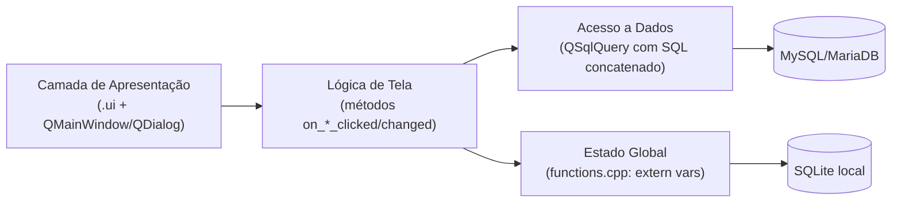
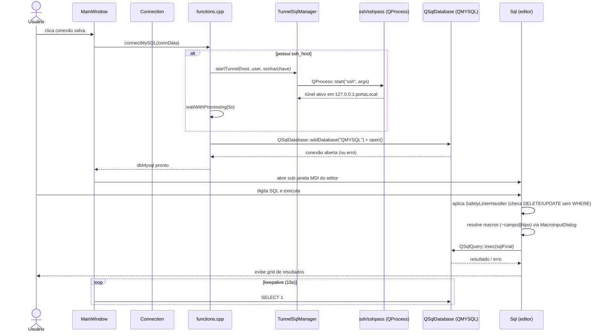

# Visão Geral da Arquitetura

## O que é o SequelFast

SequelFast é um cliente desktop para MySQL/MariaDB construído com **Qt 6.9.1 Widgets** e **C++17**, buildado via **qmake** (`SequelFast.pro`). É uma aplicação monolítica de janela única com um **MDI (Multiple Document Interface)**: cada funcionalidade (editor SQL, estrutura de tabela, usuários, estatísticas, backup/restore, batch) é uma `QMainWindow` própria embrulhada em um `QMdiSubWindow` dentro da `MainWindow`.

Não há backend/servidor: a aplicação fala diretamente com o servidor MySQL/MariaDB do usuário via `QSqlDatabase`/driver `QMYSQL`, opcionalmente através de um túnel SSH levantado como processo externo (`ssh`/`sshpass`). O estado local da própria aplicação (conexões salvas, preferências, log de queries) é persistido em um banco **SQLite embutido** (`preferences.db`), completamente separado dos bancos MySQL/MariaDB gerenciados pela ferramenta.

## Mapa de Componentes

```mermaid
graph TB
    subgraph Shell["Shell da Aplicação"]
        main["main.cpp"]
        MW["MainWindow<br/>(orquestrador MDI)"]
        FN["functions.cpp<br/>(estado global + utilitários)"]
    end

    subgraph Conexao["Conexões"]
        CONN["Connection<br/>(diálogo)"]
        TUN["TunnelSqlManager<br/>(túnel SSH via QProcess)"]
    end

    subgraph Editor["Editor SQL"]
        SQL["Sql<br/>(editor + grid de resultados)"]
        HL["SqlHighlighter"]
        TC["TextEditCompleter"]
        MID["MacroInputDialog"]
        MFD["MacroFormatDialog"]
        SLH["SafetyLinterHandler<br/>(chain of responsibility)"]
    end

    subgraph Schema["Estrutura & Dados"]
        STR["Structure<br/>(editor de colunas)"]
        TCD["TwoCheckboxDelegate"]
        RDG["Delegates regex<br/>(Name/Type/YesNo)"]
    end

    subgraph Admin["Administração & Operações"]
        USR["Users"]
        STAT["Statistics"]
        BATCH["Batch<br/>(esqueleto, não implementado)"]
        BKP["Backup"]
        RST["Restore"]
    end

    subgraph Persist["Persistência Local"]
        SQLITE[("SQLite<br/>preferences.db")]
    end

    subgraph Remote["Servidor Remoto"]
        MYSQL[("MySQL / MariaDB<br/>via QSqlDatabase/QMYSQL")]
        SSHD["sshd remoto"]
    end

    main --> MW
    MW --> FN
    MW --> CONN
    MW --> SQL
    MW --> STR
    MW --> USR
    MW --> STAT
    MW --> BATCH
    MW --> BKP
    MW --> RST

    CONN --> FN
    FN --> TUN
    TUN -->|QProcess ssh/sshpass| SSHD
    FN --> SQLITE
    FN --> MYSQL
    SSHD -.tunel local.-> MYSQL

    SQL --> HL
    SQL --> TC
    SQL --> MID
    MID --> MFD
    SQL --> SLH
    SQL --> MYSQL

    STR --> TCD
    STR --> RDG
    STR --> MYSQL

    USR --> MYSQL
    STAT --> MYSQL
    BKP --> MYSQL
    RST --> MYSQL
    BKP -.arquivo .sql.-> RST
```

## Camadas (informal)

Não há uma separação formal em camadas (MVC/MVVM) — é um estilo mais próximo de **"Windows-and-Utilities"**: cada tela é uma classe `QMainWindow`/`QDialog` que mistura UI, lógica de negócio e acesso a dados (SQL montado por concatenação de string), e um módulo utilitário global (`functions.cpp`) concentra estado compartilhado e operações de conexão/preferências usadas por todas as telas.



## Documentação de Referência por Subsistema

| Subsistema | Documento |
|---|---|
| Shell da aplicação (`MainWindow`, `main`, `functions`) | [`../api/core-shell.md`](../api/core-shell.md) |
| Conexões e túnel SSH (`Connection`, `TunnelSqlManager`) | [`../api/connections.md`](../api/connections.md) |
| Editor SQL, macros, highlighting, autocomplete | [`../api/sql-editor.md`](../api/sql-editor.md) |
| Estrutura de tabelas e delegates | [`../api/schema-data.md`](../api/schema-data.md) |
| Usuários, estatísticas, batch, backup, restore, safety linter | [`../api/admin-ops.md`](../api/admin-ops.md) |

## Fluxo Ponta a Ponta: do Clique em "Conectar" à Query Executada



## Riscos e Dívidas Técnicas Identificadas no Mapeamento

Este levantamento (feito lendo o código-fonte completo) revelou pontos que impactam diretamente decisões de arquitetura — ver [ADRs](adr/) para o racional registrado de cada um:

1. **Credenciais em texto puro**: senhas de banco e SSH são gravadas sem criptografia em `preferences.db`; a senha SSH também trafega como argumento de linha de comando para `sshpass` (visível via `ps`).
2. **`Batch` é um esqueleto de UI sem lógica** — nenhuma execução em lote está implementada, apesar de exposto no menu.
3. **`SafetyLinterHandler` cobre apenas `DELETE`/`UPDATE` sem `WHERE`** — não é uma proteção geral contra comandos destrutivos, e só está integrado ao editor SQL (`Sql`), não a `Batch`/`Restore`.
4. **Dois caminhos de conexão MySQL divergentes** (`Connection::on_buttonConnect_clicked` vs. `connectMySQL` em `functions.cpp`), com timeouts e suporte a SSH diferentes.
5. **SQL montado por concatenação de string** em várias telas (`Structure`, `Users`, etc.), sem bind parameters nem escaping de identificadores — mitigado apenas parcialmente por validação de UI.
6. **`TwoCheckboxListModel` é código morto** (declarado, nunca instanciado); o único consumidor real (`Backup`) usa `QStandardItemModel`.
7. **Estado global via variáveis `extern`** (`dbMysql`, `actual_host`, `actual_schema`, etc.) assume uma única "conexão/navegação atual", mesmo com múltiplas sub-janelas MDI.

## Stack Tecnológica

| Camada | Tecnologia |
|---|---|
| UI | Qt 6.9.1 Widgets (não QML), arquivos `.ui`, temas QSS (light/dark) |
| Linguagem | C++17 |
| Build | qmake (`SequelFast.pro`) |
| Banco alvo | MySQL / MariaDB via driver `QMYSQL` (recomendado buildar contra libmariadb) |
| Persistência local | SQLite embutido (`QSQLITE`, `preferences.db`) |
| Túnel seguro | Processo externo `ssh`/`sshpass` via `QProcess` |
| Gráficos | Qt Charts (`QT += charts`) |
| i18n | Qt Linguist (`SequelFast_pt_BR.ts`), traduções embutidas no binário |
| Empacotamento | Scripts dedicados por plataforma (Linux AppImage-like, macOS Intel/Silicon `.dmg`) |
